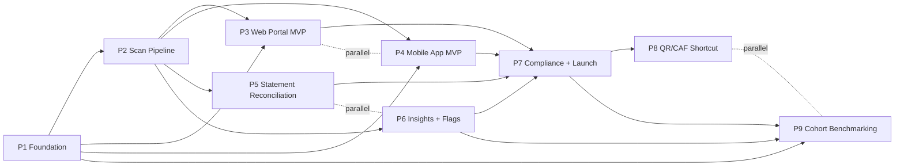

# ROADMAP — Gastify

> **Derived from `.kdbp/SCOPE.md`.** Medium-inertia. Updates on any `/gabe-scope-change` (addition, pivot, addition-of-phase, removal-of-phase) or on phase completion.
> Status: **finalized v1** (2026-04-22).

## §1 How to read this file

- **Inertia.** SCOPE is the premise (low-change). ROADMAP is the phase plan (changes as phases complete, split, or insert). Individual tasks + implementation detail live in PLAN (high-change).
- **Granularity.** 9 phases, fine-grained. Each phase covers 1–5 REQs with a tight goal. A phase's goal is the user-visible or architecturally-visible milestone it delivers.
- **Order is dependency-driven, not priority-driven.** What must exist before the next thing can run.
- **Parallel-able.** Multiple phases can run concurrently where shown in §4. The dependency graph is the ground truth, the phase table below is a reading order.
- **Tool wording follows SCOPE §9.0.** Category constraints are hard; specific tool names are suggestions-as-of-2026-04-22 owned by ADRs. When a phase goal or exit signal names a technology class (e.g., "vision LLM", "managed identity provider"), the current suggested implementation is in SCOPE §9.1.

## §2 Phase Table (at-a-glance)

| # | Phase | Goal | Depends on | Parallel with | REQs | Status |
|---|---|---|---|---|---|---|
| 1 | **Foundation** | Backend scaffold + identity + ownership-scope + money/FX + consent/processing register + observability — the stage on which everything else stands. | — | — | REQ-15, REQ-16, REQ-17, REQ-18, REQ-19, REQ-20, REQ-21, REQ-22 | pending |
| 2 | **Receipt Scan Pipeline** | Photo → two-stage vision-LLM extraction → math-gate → V4 categorization → persisted transaction with USD shadow. Dual-transport scan-progress streaming. | P1 | — | REQ-01, REQ-02, REQ-03, REQ-04, REQ-12 | pending |
| 3 | **Web Portal MVP** | Responsive static SPA — auth, receipt scan flow, transaction ledger, manual edits with `user_edited_at`, sign-out isolation. | P1, P2 | P4 | REQ-05 (web slice), REQ-13, REQ-14 (web), REQ-23 | pending |
| 4 | **Mobile App MVP** | Single cross-platform codebase → Android + iOS via managed build + OTA pipeline. Native camera, bidirectional streaming, native keystore, sign-out isolation. | P1, P2 | P3 | REQ-05 (mobile slice), REQ-13, REQ-14 (mobile), REQ-24, REQ-25 | pending |
| 5 | **Statement Reconciliation + Cards** | PDF statement upload → extraction → match against existing receipts → 3-bucket view + coverage metric. Card alias CRUD (no PCI). | P2 | P6 | REQ-07, REQ-08, REQ-09 | pending |
| 6 | **Insights + Item Flags** | Monthly view (top-N by L2), gravity-center detection, item urgency/special-case flag with personal-only scope enforcement. | P2 | P5 | REQ-06, REQ-10, REQ-11 | pending |
| 7 | **Compliance + Launch Hardening** | Four-jurisdiction regulatory readiness validated (Law 21.719, GDPR, PIPEDA, CCPA/CPRA) + launch infra + cutover drill. Paid-tier LLM pre-commit in place. Monetization plumbing live. | P1, P2, P3, P4, P5, P6 | — | Consolidates + audits REQ-20, REQ-21 | pending |
| 8 | **Structured-Boleta Shortcut** | Chilean electronic-boleta QR/CAF parser bypasses the vision LLM for structured receipts — cuts per-scan cost on SII-Resolution-52/2026 electronic boletas. Nice-to-have, post-MVP. | P2, P7 | P9 | REQ-26 | pending |
| 9 | **Cohort Benchmarking (DP-engineered)** | Consent-gated cohort aggregation with k ≥ 20 floor, ε ≤ 1 DP noise, sensitive-category suppression, revocation-aware recompute. Unlocks SC-11 / JTBD-05. Post-MVP. | P1, P6, P7 | P8 | REQ-27 | pending |

## §3 Phase Detail

### Phase 1 — Foundation {#phase-1}

**Goal.** A running API + database with identity, ownership scopes, money representation, FX infrastructure, consent plumbing, and observability — so every later phase builds on invariants that are impossible to get wrong retroactively.

**Why now.** Research §2.2 (Law 21.719 at MVP, not phase N+1), §2.4 (`ownership_scope` day 1), §2.5 (integer-minor-units). Foundation items are cheap now and catastrophic later. Every other phase depends on this one.

**Covers REQs.** REQ-15 (ownership_scope), REQ-16 (Firebase auth + JIT), REQ-17 (integer-minor-units), REQ-18 (FX snapshot + USD shadow), REQ-19 (currency + locale registry), REQ-20 (consent + processing register — four-jurisdiction), REQ-21 (observability), REQ-22 (i18n infra).

**Exit signal.** A smoke test signs in (JIT-provisions a scope-of-one user), writes a transaction with a currency other than the primary, reads back the USD shadow at the FX rate captured that day, and asserts the consent-audit endpoint returns one record.

**Depends on.** —
**Parallel with.** —

---

### Phase 2 — Receipt Scan Pipeline {#phase-2}

**Goal.** A user uploads a receipt photo. Within 30 seconds at P95, it is a persisted transaction with line-items mapped to V4 categories, math-reconciliation-gated, USD-shadowed, ownership-scope-keyed, and observable end-to-end.

**Why now.** SC-01 is Gastify's core differentiator — nothing works without this. The two-stage extraction (vision → text-only categorize) is the defense against prompt injection (research §2.1); the math-reconciliation gate (REQ-12) catches hallucinations before they corrupt the ledger.

**Covers REQs.** REQ-01 (submission), REQ-02 (two-stage worker), REQ-03 (V4 taxonomy), REQ-04 (dual streaming), REQ-12 (math gate).

**Exit signal.** 10 test receipts (mixed CLP/USD, Spanish + English, 5–40 items, 2 adversarial with embedded prompt-injection attempts, 1 math-inconsistent) processed end-to-end. All 8 benign receipts land as correct transactions; both adversarial receipts produce safe output; the math-inconsistent receipt routes to review instead of landing. Streaming events delivered in order on both transport types.

**Depends on.** P1.
**Parallel with.** —

---

### Phase 3 — Web Portal MVP {#phase-3}

**Goal.** A first-time user signs in on a laptop or mobile browser, scans a receipt via file upload, sees the scan progress stream, opens their transaction, edits one field, signs out, and has no authenticated data reachable from the browser afterward.

**Why now.** Web is the highest-bandwidth surface for the first end-to-end user journey (keyboard + large screen). Proves the receipt flow before the mobile build. SC-08 (sign-out isolation) is E2E-tested here.

**Covers REQs.** REQ-05 (ledger API, web slice), REQ-13 (user-edit precedence), REQ-14 (web sign-out eviction), REQ-23 (responsive web portal).

**Exit signal.** Web E2E journey green (framework per §9.1): sign in → scan receipt → watch streaming events → see transaction → edit merchant name → assert `user_edited_at` set → sign out → re-open tab → no cached account data fetchable.

**Depends on.** P1, P2.
**Parallel with.** P4.

---

### Phase 4 — Mobile App MVP {#phase-4}

**Goal.** A first-time user installs the app from the iOS beta channel or internal Play Store channel, signs in with their managed-auth account, scans a receipt with the device camera, sees the scan progress stream over the mobile transport, opens their transaction, edits one field, signs out, and has no authenticated data reachable via the device keystore or app storage afterward.

**Why now.** The native mobile surface is where the majority of scan-capture happens in the wild (phone camera > laptop upload). Establishes the managed mobile build + OTA pipeline + native capability parity with web. Closes the loop on all 3 client surfaces for SC-08.

**Covers REQs.** REQ-05 (ledger API, mobile slice), REQ-13 (user-edit precedence, shared with P3), REQ-14 (mobile sign-out eviction for both iOS + Android), REQ-24 (cross-platform mobile app), REQ-25 (push notifications registration).

**Exit signal.** Mobile E2E journey green (framework per §9.1) on both iOS + Android simulated builds: sign in → camera scan → streaming events → transaction view → edit → sign out → assert platform-keystore cleared + no cached API data.

**Depends on.** P1, P2.
**Parallel with.** P3.

---

### Phase 5 — Statement Reconciliation + Cards {#phase-5}

**Goal.** A user uploads a credit card statement PDF, registers the card alias if new, watches the extraction + reconciliation progress, and sees every statement line bucketed (matched / statement-only / receipt-only) with a coverage percentage for the period.

**Why now.** SC-04 is the second-differentiator and closes the coverage gap from §2 problem statement. Needs P2's worker infrastructure and the two ingestion modes share streaming + categorization code paths.

**Covers REQs.** REQ-07 (statement upload + extraction), REQ-08 (reconciliation engine + coverage), REQ-09 (card alias CRUD).

**Exit signal.** A user with 20 days of receipt scans uploads their monthly statement. Reconciliation runs, coverage metric reads (for example) "72% of statement spend has a matched receipt," and the user can drill into the 28% bucket to find one forgotten subscription and one charge-they-don't-remember.

**Depends on.** P2.
**Parallel with.** P6.

---

### Phase 6 — Insights + Item Flags {#phase-6}

**Goal.** A user opens the app on any client, sees their top-5 L2 categories for the current month in ≤ 20 seconds app-open-to-visible, reads the gravity-center ranking showing which categories are growing or shrinking vs. their baseline, and flags one item as "special-case" — which disappears from all aggregate views while staying in their transaction record.

**Why now.** Insight is where the scanned data turns into behavior change. Uses P2's data stream + depends on having a few weeks of transactions accumulated (i.e., runs alongside P5 rather than after).

**Covers REQs.** REQ-06 (monthly analytics view), REQ-10 (gravity-center detection), REQ-11 (item flag + personal-only scope enforcement).

**Exit signal.** Test user with 3 months of seeded transactions opens the monthly view. Top-5 renders within 20 seconds. Gravity-center list shows at least one growth category. User flags one line item; re-renders analytics, the item is excluded from aggregates but still visible on the transaction detail.

**Depends on.** P2.
**Parallel with.** P5.

---

### Phase 7 — Compliance + Launch Hardening {#phase-7}

**Goal.** Audited readiness for four-jurisdiction regulatory compliance (Law 21.719, GDPR, PIPEDA, CCPA/CPRA), paid Gemini tier active, monetization plumbing (billing hooks, plan tiers at schema level) live, launch-day incident runbook rehearsed.

**Why now.** The launch gate. Every earlier phase has dropped its compliance and operational scaffolding; this phase asserts that scaffolding is real — data-subject-rights endpoints work, consent records are queryable, sensitive-category suppression holds in aggregation surfaces, scan-queued graceful degradation works under quota throttle.

**Covers REQs.** Consolidates and audits REQ-20 (consent + processing register) + REQ-21 (observability) across all prior phases. No new REQs — this is a validation + hardening phase.

**Exit signal.** (a) A data-subject-rights request (access/rectification/erasure/portability) can be serviced end-to-end on a test user. (b) Consent revocation triggers downstream cohort-unflag. (c) A load test drives the extraction-LLM service to quota throttle — all scans gracefully enter `queued` state, no 5xx. (d) Retention policy deletes test data older than declared TTL. (e) Go/no-go readiness checklist signed.

**Depends on.** P1, P2, P3, P4, P5, P6.
**Parallel with.** —

---

### Phase 8 — Structured-Boleta Shortcut {#phase-8}

**Goal.** For electronic Chilean boletas (SII Resolution 52/2026, effective May 1 2026) that carry a QR/CAF code, Gastify detects the code, parses the structured payload directly, and produces a transaction without calling the vision LLM. Vision pipeline remains the default for paper/photo receipts.

**Why now.** Post-MVP, nice-to-have. User explicitly classified as non-MVP at Checkpoint 2 follow-up. Dramatically cuts per-scan cost for Chilean users long-tail. Parallel with P9 (both late-phase, independent).

**Covers REQs.** REQ-26.

**Exit signal.** A Chilean user uploading a post-May-2026 electronic boleta with a valid QR code sees a transaction produced in < 3 seconds with 0 extraction-LLM tokens consumed. Paper-receipt path unchanged.

**Depends on.** P2 (for worker infrastructure), P7 (to ship).
**Parallel with.** P9.

---

### Phase 9 — Cohort Benchmarking (DP-engineered) {#phase-9}

**Goal.** A user who opts in (explicit consent flow, revocable) sees their spending in any category compared against an anonymized cohort of ≥ 20 similar households, with DP noise floor ε ≤ 1, sensitive-category suppression enforced, and no cached-cohort leak on revocation.

**Why now.** Post-MVP — override-01. Requires user base to accumulate (k ≥ 20 is a hard gate; ship too early = empty cohorts and product silence). The DP + k-anonymity + suppression sub-architecture is its own work package.

**Covers REQs.** REQ-27. Depends on REQ-20 consent infrastructure already shipped in P1/P7.

**Exit signal.** Test cohort of 50 synthetic user profiles loaded. User in cohort opts in, sees their grocery spend compared to the cohort baseline (a single bar chart). One user revokes; within a recompute cycle, their data is absent from the next aggregation. No cached-cohort query returns their data post-revocation.

**Depends on.** P1 (consent), P6 (analytics infrastructure), P7 (compliance audit).
**Parallel with.** P8.

---

## §4 Dependency Graph

**Critical path:** P1 → P2 → (P3 ∥ P4 ∥ P5 ∥ P6) → P7 → launch. Post-launch: P8 ∥ P9.

## §5 Coverage Matrix (REQ × Phase)

| REQ | Phase |
|---|---|
| REQ-01 | P2 |
| REQ-02 | P2 |
| REQ-03 | P2 |
| REQ-04 | P2 |
| REQ-05 | P3 + P4 (client-slice each; single backend in P2) |
| REQ-06 | P6 |
| REQ-07 | P5 |
| REQ-08 | P5 |
| REQ-09 | P5 |
| REQ-10 | P6 |
| REQ-11 | P6 |
| REQ-12 | P2 |
| REQ-13 | P3 + P4 |
| REQ-14 | P3 (web) + P4 (mobile) |
| REQ-15 | P1 |
| REQ-16 | P1 |
| REQ-17 | P1 |
| REQ-18 | P1 |
| REQ-19 | P1 |
| REQ-20 | P1 (schema) + P7 (audit) |
| REQ-21 | P1 (schema) + P7 (audit) |
| REQ-22 | P1 |
| REQ-23 | P3 |
| REQ-24 | P4 |
| REQ-25 | P4 |
| REQ-26 | P8 |
| REQ-27 | P9 |

**27 / 27 REQs mapped to a phase.** No orphans.

**Coverage note:** REQ-05 + REQ-13 + REQ-14 each appear under two phases — this is deliberate. The backend slice ships in P2/P3; the client slice ships in P3 (web) and P4 (mobile). At finalize, these are represented as single REQs with phase-pair ownership — not duplicates.

## §6 Roadmap Change Log

| Date | Version | Change |
|---|---|---|
| 2026-04-22 | v1 | init — derived from SCOPE.md v1. 9 phases (granularity = fine). 27 REQs mapped; no orphans. Critical path P1 → P2 → (P3∥P4∥P5∥P6) → P7 → launch. Post-launch: P8 ∥ P9. |
