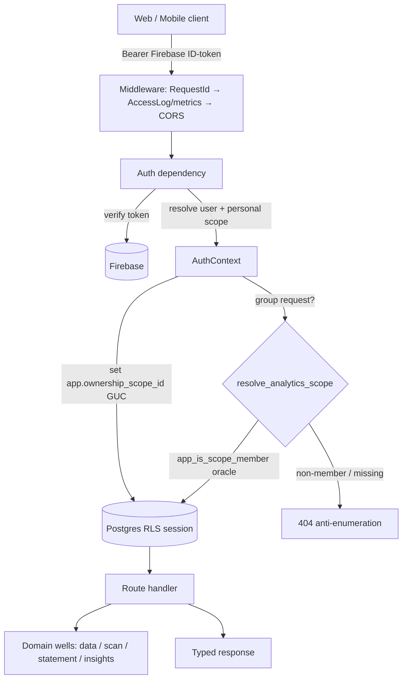
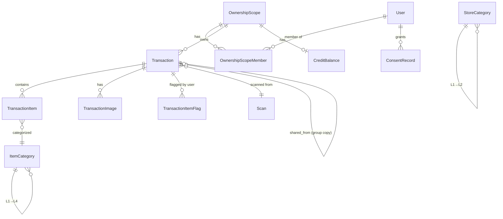

# Architecture
<!-- Standards: see ~/.claude/skills/gabe-docs/SKILL.md (CommonMark + Mermaid + analogy-first) -->

Gastify is a Chilean smart expense tracker: scan a receipt, get a categorized,
multi-currency, shareable ledger with analytics. Think of it as **three storefronts
over one vault** — a FastAPI backend that owns the vault (Postgres with row-level
security), and two clients (a React web portal and a React Native mobile app) that
are deliberately kept thin. The vault decides who sees what; the storefronts only
ever ask politely and render what they're handed.

This document is the top-level map. Each subsystem (a "gravity well") has its own
deep-dive under [docs/wells/](wells/); this page explains how the pieces fit and the
invariants that hold across all of them.

## System Overview

Three surfaces, one contract:

| Surface | Stack | Role |
|---------|-------|------|
| **Backend** | FastAPI · async SQLAlchemy · Postgres (RLS) · Alembic · Gemini · Firebase | Owns data, auth, scope isolation, scan/statement AI pipelines, analytics aggregation |
| **Web portal** ([docs/wells/6-web-portal.md](wells/6-web-portal.md)) | React 19 · Vite · TanStack Router/Query · Zustand | Primary desktop/responsive surface — scan, ledger, dashboards, statements, groups, reports |
| **Mobile app** ([docs/wells/7-mobile-app.md](wells/7-mobile-app.md)) | React Native · Expo · EAS · TanStack Query · Zustand | Native Android (iOS deferred) — camera capture, WebSocket scan progress, secure keystore, push |

Both clients share a single **OpenAPI-generated type layer** (openapi-typescript) so
the data contract is enforced at compile time without a shared npm package. There is
no business logic in the clients that the backend doesn't also enforce — the backend
is the source of truth, the clients are projections.

### Request flow



Every request enters through one of 11 routers, passes three middleware layers,
authenticates against Firebase, resolves an ownership scope, and sets the Postgres
RLS GUC **before any query runs**. Group access additionally validates membership
through a `SECURITY DEFINER` oracle *before* swapping scope — never the reverse.

## Subsystems (gravity wells)

The backend and clients decompose into seven wells. Each has a dedicated doc; this is
the one-paragraph orientation.

### G1 — API Core · [doc](wells/1-api-core.md)
The request-entry boundary and cross-cutting plumbing: FastAPI app factory, 11
routers, three middleware (RequestId, AccessLog+metrics, CORS), the Firebase auth
dependency, RLS GUC plumbing, scope-swap gates, config/environment-policy validation,
and an in-memory Prometheus-compatible metrics registry. G1 owns the request
lifecycle and delegates all business logic to the domain wells.

### G2 — Data Model · [doc](wells/2-data-model.md)
The canonical shape of every domain object — SQLAlchemy ORM tables, Pydantic
request/response schemas, Alembic migration history, and the V4 category taxonomy.
Enforces money/FX/ownership invariants at the schema and database layer: every tenant
table chains to `OwnershipScope` under RLS, amounts are minor-unit `BigInteger`, FX is
lazily cached per (date, from, to) with structural idempotency.

### G3 — Identity + Ownership · [doc](wells/3-identity-ownership.md)
The authentication and multi-tenant authorization spine. Firebase OAuth → AuthContext
→ `ownership_scope_id`. JIT-provisions user + personal scope + membership + credits
atomically on first login. Groups extend the model via RLS scope-swap (validated by
the `app_is_scope_member` oracle). Consent is per-purpose and jurisdiction-aware
(Chile Law 21.719, GDPR, PIPEDA, CCPA/CPRA).

### G4 — Scan Pipeline · [doc](wells/4-scan-pipeline.md)
The receipt scan path: Gemini vision extraction → deterministic coalescing →
PydanticAI categorization (V4 L4) → math reconciliation gate (1-minor-unit tolerance)
→ runtime review signals → persistence, with SSE + WebSocket progress streaming. AI
uncertainty is contained behind typed contracts and a fail-closed math gate — scans
that don't reconcile route to `NEEDS_REVIEW`, never silent completion.

### G5 — Integrations · [doc](wells/5-integrations.md)
The boundary to every external service — Firebase (auth), Gemini (receipt + statement
extraction), the FX-rate API, and PyMuPDF (PDF parsing). One adapter file per service
("single doorway"): retry policy, error classification, JSON repair, and the D76
provider-selection logic all live here so downstream wells never see raw HTTP failures
or LLM quirks.

### G6 — Web Portal · [doc](wells/6-web-portal.md)
The production web SPA. Scope-aware: `uiStore.activeScope` (Zustand) toggles
personal/group context, the backend swaps the RLS GUC, and TanStack Query invalidates
its cache per scope. Implements all core workflows — scanning (SSE + auto-reconnect),
ledger (optimistic edits + rollback), dashboards/trends (server-aggregated insights),
statement reconciliation, and group sharing (consent-gated detail, content-lock).

### G7 — Mobile App · [doc](wells/7-mobile-app.md)
The native React Native client. Mirrors web's data model and adds native capabilities:
camera capture, WebSocket scan progress (with REST-poll fallback), secure keystore
token storage (expo-secure-store), and Expo push registration tied to auth lifecycle.
Same OpenAPI types, same scope-aware store. Proven on a physical Android S23; iOS
deferred post-roadmap (D47).

## Cross-cutting invariants

These hold across every well and are the load-bearing rules of the system. Violating
any one is a data-safety or correctness regression, not a style nit.

1. **RLS is always enforced.** Every Postgres-backed request sets
   `app.ownership_scope_id` on the session GUC before any query. Policies deny by
   default; the runtime `gastify_app` role is `NOBYPASSRLS`, and a boot guard
   (`assert_least_privilege_role`) refuses to start otherwise (D3, D67, P43). The GUC
   is re-applied on every transaction (`after_begin`) so it survives mid-request
   commits.

2. **Scope-swap is validate-then-swap.** Group access calls `resolve_analytics_scope`
   → `app_is_scope_member` (a `SECURITY DEFINER` oracle) and only swaps the GUC on a
   `true` membership result. A non-member never causes the GUC to point at the group;
   non-member and non-existent group both return 404 (anti-enumeration) (D70).

3. **Money is minor-unit integers.** All amounts are `BigInteger` minor units (1234 =
   $12.34 USD or $1,234 CLP); `ZERO_EXPONENT_CURRENCIES` handles no-decimal currencies.
   No floats touch financial data (D2).

4. **The AI math gate is fail-closed.** Receipt extraction that fails reconciliation
   (delta > 1 minor unit) routes to `NEEDS_REVIEW` with typed review signals — never
   silent completion. All LLM output is consumed as structured Pydantic types, never
   regex-parsed (D30).

5. **Content-lock is per-source.** Once a transaction is shared to a group
   (`is_shared=true`), its merchant/amount/date/items/currency are immutable on the
   personal source (D74). Tangential ops (delete, card pairing, recurrence, item
   flags) remain allowed. Re-sharing the same source is blocked structurally
   (`uq_transactions_scope_shared_from`).

6. **Personal flags never leak into aggregates.** Item flags live in the caller's
   personal scope (RLS-invisible under a group GUC). Group monthly/tree/series
   aggregates sum every group row, unfiltered by flags. Exclusion is caller- and
   scope-local (D58, D70).

7. **Bearer-token only, no CSRF.** The API accepts `Authorization: Bearer
   <Firebase-ID-token>` only — no cookies, no ambient credentials, no CSRF surface.
   Mobile is naturally immune (D33).

8. **Gemini provider parity is enforced by environment (D76).** `staging-e2e` is
   always deterministic (fixture/mock forced at config validation); `staging` and
   `production` run **real** Gemini (mock/fixture refused); local development is
   `mock`. Enforced at startup, not runtime — misconfiguration is caught before any
   request arrives.

## Data model

`OwnershipScope` is the root every tenant row chains back to. Simplified:



- **OwnershipScope** is `individual` (personal) or `group`. RLS keys on it.
- **Transaction** carries scan provenance, recurrence annotations, share provenance
  (`shared_by_user_id`, `shared_from_transaction_id`), and the content-lock flag.
- **TransactionItemFlag** is a user-scoped association row — personal exclusion in
  aggregates without hiding data from the detail view.
- **StoreCategory** (L1–L2) and **ItemCategory** (L1–L4) are the self-hierarchical V4
  taxonomy, single-sourced in `reference/categories.py` and shared with the G4
  extraction prompts.

## Environments & deploy flow

| Environment | Database | Gemini | Purpose |
|-------------|----------|--------|---------|
| **local** | SQLite | `mock` | Developer machine, fast unit/integration loop |
| **staging-e2e** | Postgres | `fixture`/`mock` (forced) | Deterministic E2E — Playwright (web) + Maestro (S23) screenshot proofs |
| **staging** | Postgres | **real** | Production-like pre-promotion validation |
| **production** | Postgres | **real** | Live |

Deploy is a forward-only promotion:

```
feature branch → push origin HEAD:staging  (Railway deploys staging-e2e + CI gate)
              → B2 proofs (web Playwright + S23 Maestro against deployed staging-e2e)
              → fast-forward promote staging → main  (production)
```

CI gates the deploy: SCA audit, type checks, and test suites must be green before
Railway promotes. A failing check blocks the deploy (e.g. a transitive pip CVE once
blocked a Reports deploy until the lockfile was bumped).

## Key decisions

The architecture is traceable to decision records in [.kdbp/DECISIONS.md](../.kdbp/DECISIONS.md).
The load-bearing ones:

- **D2** — minor-unit money + lazy FX cache with structural idempotency
- **D3 / D67 / P43** — Postgres RLS deny-by-default + least-privilege roles + boot guard
- **D30** — fail-closed math gate, structured LLM output
- **D33** — Firebase-native auth, bearer-only, zero-code token refresh
- **D34 / D39** — SSE (web) / WebSocket+poll (mobile) scan progress with auto-reconnect
- **D58 / D70** — group RLS scope-swap (validate-then-swap) + personal-flag isolation
- **D69** — server-aggregated analytics (no client global buffer)
- **D73 / D74** — consent-gated detail visibility + transaction content-lock on share
- **D76** — Gemini provider parity enforced by environment
- **D77** — reports granularity (week/month/quarter/year), ISO-week bucketing
```