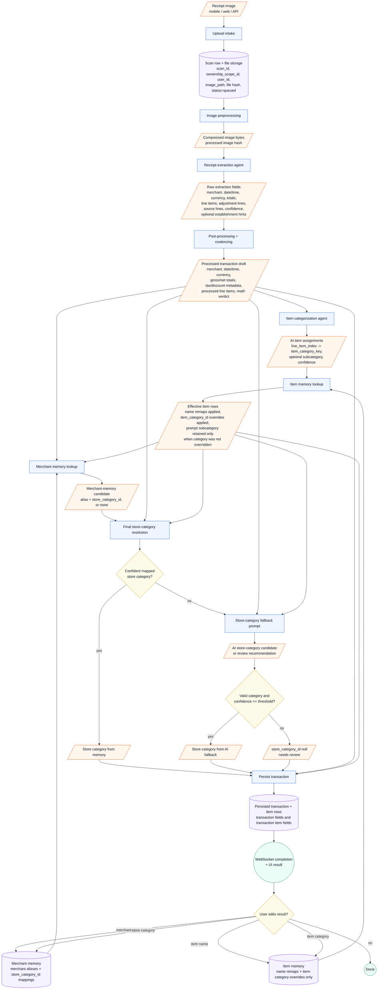

# Transaction Categorization Study

Study date: 2026-05-19

Scope: compare legacy Boletapp transaction/store categorization with current
Gastify and recommend a future implementation path. This is a study artifact
only; it does not change code, prompts, schemas, migrations, or tests.

## Working Definition

Transaction categorization means the top-level merchant/store category for the
receipt, represented in Gastify by `Transaction.store_category_id`.

This is separate from line-item categorization. Current Gastify already maps
line items to `TransactionItem.item_category_id` through
`CategorizationResult.assignments`.

## Recommendation

Use **Option C plus Option D**:

1. Run item categorization for processed product or service line items.
2. Apply remembered item name and item-category overrides only.
3. Resolve the final transaction/store category **after item categorization and
   item-memory overrides**: use the remembered merchant category if it is
   confident; otherwise run the separate lightweight merchant/store-categorization
   fallback using the effective item-category distribution as input.

Do not make the extraction prompt the primary owner of transaction
categorization. The extraction prompt should remain focused on visible receipt
facts. It may later expose raw hints such as `receipt_type`, merchant text,
country/city, source lines, or short establishment clues visible on the receipt.
Those hints should be evidence for the later store-categorization fallback, not
the persisted final store category.

Do not overload the current item-categorization prompt as the primary owner of
transaction categorization. It is cheaper than the vision prompt, but it is
optimized for item categories and currently receives item text, merchant, and
currency only. Store category is an independent "where you bought" dimension.

Proceed with implementation only after the Gabe review remediation below is
accepted. The review found that the strategy is sound, but the active codebase
still has a mismatched taxonomy/prompt/mapping contract. The implementation must
therefore start with the contract work, not with the merchant fallback prompt.

## Legacy Boletapp Findings

Legacy Boletapp used a single receipt image prompt for both transaction and item
categorization. Prompt versions such as `v3-category-standardization` produced:

- `category`: the store/category of the transaction;
- `items[].category`: each item category;
- optional `items[].subcategory`;
- `metadata.receiptType` and confidence fields.

The legacy prompt explicitly separated the two dimensions:

- store category = type of establishment;
- item category = what the item is.

Legacy taxonomy data lived in `shared/schema/categories.ts`:

- `STORE_CATEGORIES`: 44 store categories;
- `ITEM_CATEGORIES`: 42 item categories;
- English canonical keys with user-facing display labels/hints.

Legacy also had post-scan learning:

- merchant mappings could normalize a merchant and assign a store category;
- category mappings could assign item categories from learned item names;
- auto-apply used a confidence threshold before replacing AI output;
- corrections from expected files show why category validation matters.

Examples from the legacy corpus:

| Case | AI store category | Corrected/store expectation | Item category behavior |
|---|---|---|---|
| `supermarket/super_lider` | `Supermarket` | `Supermarket` | Item categories such as `Snacks`, `BreadPastry`, `Pantry`, `PreparedFood` |
| `restaurant/restaurant_2001_recibo` | `Restaurant` | `Restaurant` | Single synthetic `PreparedFood` line for the receipt total |
| `other/estacionamiento` | `Parking` | corrected to `Transport` in legacy expected data | Single service line |
| `other/test_villarrica` | `Electronics` | corrected to `ElectronicsStore` in legacy expected data | Item categories remained electronics-oriented |

The corrections matter: legacy AI output sometimes used an item-like category
or a too-specific category as the store category. A Gastify implementation needs
taxonomy validation and low-confidence fallback behavior.

## Current Gastify State

Current Gastify has the persistence fields needed for transaction
categorization:

- `Transaction.store_category_id`;
- `Transaction.store_category_user_edited_at`;
- `Transaction.merchant_source`;
- `MerchantMapping.store_category_id`;
- `CategoryMapping.target_category_id`;
- `/api/v1/reference/store-categories`.

Current scan execution does not assign `store_category_id`:

- extraction returns merchant/date/currency/totals/line items, not store
  category;
- item categorization returns only `CategoryAssignment(line_item_index,
  category_key, confidence)`;
- `persist_scan_result()` sets item category IDs and `merchant_source="ocr"`;
- `persist_scan_result()` does not set `Transaction.store_category_id`.

Current item subcategory support is partial:

- `TransactionItem.subcategory` exists in the DB model and transaction API
  schemas;
- current scan extraction/categorization schemas do not return item
  subcategory;
- `persist_scan_result()` does not populate subcategory from scan output.

Current reference data also has an implementation gap for this feature:

- `store_categories` exists as a table and API surface;
- local bootstrap currently seeds only `Supermarket`;
- the full V4 taxonomy is seeded into `item_categories`, not into a complete
  store-category reference set.

That means a future implementation needs to define and seed a real canonical
store taxonomy before `store_category_id` can be reliably populated beyond the
single local `Supermarket` seed.

There is also a mapping-contract ambiguity to resolve before implementation:
`CategoryMapping.target_category_id` currently foreign-keys `store_categories`,
while scan item categorization persists assignments into `item_categories`. If
`CategoryMapping` is meant for line-item learning, its target table is likely
wrong or underspecified. If it is meant for store-category learning, its name and
fields are misleading. Do not build new scan logic on that table until this is
decided.

## Legacy vs Gastify Comparison

| Dimension | Legacy Boletapp | Current Gastify |
|---|---|---|
| Store category source | Image prompt output `category`, then merchant mapping/corrections could override | Field exists, but scan path does not set it |
| Item category source | Same image prompt output `items[].category`, then learned item/category mappings | Separate text-only PydanticAI item-categorization agent |
| Taxonomy shape | Separate `STORE_CATEGORIES` and `ITEM_CATEGORIES` lists | Separate DB tables, but only item V4 taxonomy is broadly seeded today |
| User correction/learning | Merchant mappings and category mappings auto-applied after scan | Mapping tables exist, but scan-time store-category mapping is not wired |
| Prompt cost/complexity | One large image prompt handled extraction plus both category dimensions | Two-stage pipeline: vision extraction, text item categorization |
| Risk | Store and item dimensions could blur; expected files show invalid store outputs | Cleaner stage separation, but missing transaction category assignment |

## Candidate Options

| Option | Description | Strengths | Risks | Verdict |
|---|---|---|---|---|
| A | Extraction prompt returns merchant/store category from image context | One provider call; can use visual/receipt layout hints | Bloats the expensive vision prompt; mixes visible fact extraction with classification; harder to replay and score; higher prompt-injection surface | Rejected as primary. Accept only a raw hint later if useful |
| B | Item categorization prompt also returns transaction/store category | Reuses existing text-only provider call; cheap compared with vision | Overloads item stage; category can drift from item mix instead of merchant/store identity; lacks image/layout context unless prompt grows | Acceptable short-term fallback, not preferred |
| C | Deterministic merchant memory inside final store-category resolution | Cheap, stable, user-learnable, aligns with legacy correction behavior, cacheable | Cold-start unknown merchants still need fallback | Recommended deterministic branch before AI fallback |
| D | Separate lightweight merchant categorization prompt after item categorization and remembered item overrides | Clean separation; cheap text prompt; can use merchant evidence plus effective item-category distribution; cacheable by normalized merchant/context/item-category summary; easy to score and promote independently | Extra provider call when no mapping exists; requires schema/API tests and full store taxonomy seed | Recommended AI fallback |

## Gabe Review Remediation Plan

Review date: 2026-05-19.

Verdict: **conditional proceed**. The study direction is valid, but the
implementation plan must close these gaps before coding the store categorizer:

| Order | Review finding | Plan fix |
|---|---|---|
| 1 | Current item prompt exposes L1/L2/L3 and allows parent categories, while the target model says prompts may emit only L2/L4. | Build a canonical four-level taxonomy reference first. It must render two prompt-safe projections: L2 `Business Type` keys for store categorization and L4 `Category` keys for item categorization. L1/L3 must be excluded from prompt output schemas. |
| 2 | Complete L2 store taxonomy is not implemented or seeded. | Seed full store L1/L2 taxonomy in migrations/bootstrap for local, staging-e2e, staging, and production before any fallback prompt can persist `store_category_id`. |
| 3 | Remembered mapping cannot be implemented from current contracts. | Define mapping contracts before auto-apply: merchant alias/category memory, item-name memory, and item-category memory pointing at `item_categories`. Do not reuse the current ambiguous `CategoryMapping` contract without migration/rename/clarification. |
| 4 | Store category provenance is not persisted. | Add store-category source/provenance before scan persistence starts assigning categories: source, confidence, matched mapping id when present, and review/unknown state. Do not overload `merchant_source`. |
| 5 | Active execution can route around this backend data-contract work. | Add this as `Phase 2C - Transaction categorization contract`, a blocking prerequisite to closing the current Phase 2 scan work. |
| 6 | Day-zero Spanish support lacks tests. | Add backend and client tests proving every L1-L4 node has English and Spanish labels, APIs return labels, clients display labels by current locale, and prompts still use English canonical keys. |

The corrected execution order is:

1. `Phase 2C.1` canonical taxonomy split and seed:
   L1 `Industry` + L2 `Business Type` for stores; L3 `Family` + L4
   `Category` for items.
2. `Phase 2C.2` prompt projections and schema guards:
   store prompt output validates only L2; item prompt output validates only L4.
3. `Phase 2C.3` remembered mapping schema/services:
   merchant alias/category, item name, item category; no subcategory memory.
4. `Phase 2C.4` store-category resolution service:
   merchant memory first, separate lightweight fallback prompt second.
5. `Phase 2C.5` scan persistence and provenance:
   persist `store_category_id`, source, confidence, mapping id, and reviewable
   unknown/low-confidence state.
6. `Phase 2C.6` prompt-lab, backend, client, and staging tests:
   score transaction category separately, verify locale labels, and prove the
   category appears in S23 staging-e2e/staging artifacts.

## Future Implementation Shape

Recommended pipeline:

0. Contract prerequisite: complete Phase 2C before any transaction/store
   category is marked done. This includes the canonical taxonomy split, prompt
   projections, mapping-memory contracts, provenance fields, and locale tests
   described in the remediation plan.
1. Extraction stage returns visible receipt facts only:
   merchant, date/time, country/city, receipt type, source lines, line items,
   totals, adjustments, confidence, and optional establishment hints.
2. Post-processing normalizes money, quantities, totals, and reconstruction.
3. Item categorization runs as its own required stage. Input is processed line
   items, merchant, and currency. Output is the actual item category for each
   item plus an optional item subcategory for each item. The item category must
   be a validated L4 `Category` key/id; the subcategory is nullable prompt
   evidence and must be narrower than that selected item category.
4. Item memory lookup applies remembered item corrections before store fallback:
   item name remaps and item category overrides only. It must not overwrite
   quantity, prices, discounts, unit metadata, or subcategory. If memory
   overwrites the item category, any prompt-proposed subcategory must be cleared
   because it was produced under a different category context. If memory only
   remaps the item name, the prompt-proposed subcategory can remain. These
   mappings are fed by prior user edits and should be scoped by ownership,
   normalized merchant when useful, and normalized item name.
5. Merchant memory lookup runs after effective item rows exist. It produces a
   candidate alias and candidate `store_category_id` from normalized merchant
   plus ownership scope. This is the deterministic memory layer fed by prior
   user edits.
6. Final transaction/store category resolution uses the merchant-memory category
   if confidence is high; otherwise it runs the merchant/store categorization
   fallback prompt. The fallback output must be a validated L2 `Business Type`
   key/id. The fallback input must include normalized merchant, raw
   merchant, receipt type, country, city, optional extraction hints, effective
   item-category distribution, item count, service/no-item flags, and a compact
   top-item summary.
7. Persistence writes:
   `Transaction.store_category_id` from mapping or AI fallback;
   dedicated store-category source/provenance fields; and `Transaction.merchant_source`
   remains about the merchant text source only.

Suggested internal result contract for the future stage:

```text
StoreCategorizationResult
- category_key
- confidence
- source: mapping | ai | user | unknown
- matched_mapping_id
- prompt_id
- model
- rationale_short
- needs_review
```

Persist only validated categories. If confidence is below threshold or no valid
category exists, leave `store_category_id` null and mark the scan or transaction
as needing review once the review contract exists.

## Workflow Diagram



Assignment timing:

| Field group | Assigned or derived at |
|---|---|
| Scan identity and file fields | Upload intake |
| Raw merchant/date/currency/totals/line evidence | Extraction agent |
| Normalized totals, money, quantity, discounts, service rows, math verdict | Post-processing |
| AI item category and optional subcategory candidates | Item categorization agent |
| Effective item name/category and retained/cleared prompt subcategory | Item memory lookup after item categorization |
| Merchant alias and deterministic store-category candidate | Merchant memory lookup after effective item rows exist |
| Final `store_category_id` | Final store-category resolution after effective item rows exist |
| Persisted transaction and item rows | Persistence |
| Learned future mappings | User correction/save flow after result review |

## Remembered Mapping Requirement

The deterministic path is not a static taxonomy lookup. It is the user-specific
memory layer built from corrections the user makes in the application. Preserve
the legacy behavior in a Postgres/Gastify shape:

| Memory | Triggering user edit | Future auto-apply behavior | Notes |
|---|---|---|---|
| Merchant name mapping | User edits establishment name | raw/normalized merchant -> preferred display merchant | Also increments usage when applied |
| Merchant category mapping | User changes transaction/store category | raw/normalized merchant -> `store_category_id` | This is the Option C deterministic store-category source |
| Item name mapping | User edits an item name | normalized merchant + normalized item -> preferred item name | Merchant scope avoids cross-store false positives |
| Item category mapping | User changes an item category | normalized merchant/item context -> `item_category_id` | This should feed the effective item-category distribution |

All remembered mappings must be scoped by ownership/user, confidence, source,
usage count, created/updated timestamps, and reviewable management UI. Applying
learned item mappings should happen before final transaction/store category
resolution, because the store fallback should see the same item categories the
user will see. Remembered item mappings may overwrite only the item name and
item category. If a remembered category is applied, clear any AI-proposed
subcategory from that item instead of carrying a stale subcategory across the
category change.

Current Gastify already has `MerchantMapping` and `CategoryMapping`, but the
contracts need cleanup before implementation:

- `MerchantMapping` can remain the merchant name/category memory table if it
  supports alias plus `store_category_id`;
- `CategoryMapping.target_category_id` currently points at `store_categories`,
  which conflicts with item-category learning; item category memory should point
  at `item_categories`;
- item name memory is not represented as a first-class model yet;
- subcategory memory is intentionally out of scope for this implementation
  shape; do not add it to the Remember lookup unless a later plan explicitly
  reopens that decision.

## Item Subcategory Requirement

Each item may have at most one optional subcategory:

- value type: nullable string;
- no fixed taxonomy in this phase;
- prompt may propose it freely, but it must be a narrower subcategory of the
  selected item category;
- user may edit it on the current transaction item;
- it is not remembered or auto-applied in the Remember lookup;
- if remembered item memory overwrites the item category, the prompt-proposed
  subcategory must be removed.

Current DB/API already expose `TransactionItem.subcategory`, but scan extraction,
categorization, persistence, OpenAPI/mobile/web generated types, and prompt-lab
scoring must be checked before claiming end-to-end support.

## Extraction Hint Requirement

The extraction stage should not decide the final store category, but it can
collect small, bounded hints that help the later fallback prompt. Examples:

- visible receipt type such as invoice, boleta, ticket, parking receipt, or
  restaurant receipt;
- printed establishment words such as restaurant, cafe, parking, pharmacy,
  hotel, clinic, gas station, or utility;
- merchant subtitle or business line if printed near the merchant name;
- source-line snippets that support the hint.

These hints must stay optional and evidence-like. They should not expand into a
large classification prompt inside extraction, and they should never bypass
taxonomy validation.

## Four-Level Taxonomy Requirement

Before implementation, define the canonical four-level taxonomy for Gastify,
based on the legacy shape:

| Level | English canonical name | Spanish label | Applies to | Purpose |
|---|---|---|---|---|
| L1 | Industry | Rubro | Transaction/store grouping | Groups store categories for reporting |
| L2 | Business Type | Giro | Transaction/store category | The kind of establishment |
| L3 | Family | Familia | Item grouping | Groups item categories for reporting |
| L4 | Category | Categoría | Item category | The kind of item/service |

Prompting boundary:

- prompts may choose only L2 `Business Type` keys for transaction/store category;
- prompts may choose only L4 `Category` keys for item category;
- prompts must not choose L1 `Industry` or L3 `Family`;
- L1 and L3 are deterministic parent/group metadata derived from the selected
  L2 or L4 keys for statistics, filters, drill-down, charts, and UI grouping.

Implementation guard: the current item prompt/taxonomy surface must be changed
before promotion, because it still exposes parent/group levels as possible item
answers. Tests must fail if L1/L3 keys appear in prompt output schemas,
candidate lists, persisted AI category fields, or prompt-lab expected outputs.

Legacy category groups to preserve as the starting point:

| Level | Group names |
|---|---|
| L1 Rubros | Supermercados; Restaurantes; Comercio de Barrio; Vivienda; Salud y Bienestar; Tiendas Generales; Tiendas Especializadas; Transporte y Vehículo; Educación; Servicios y Finanzas; Entretenimiento y Hospedaje; Otros |
| L3 Familias | Alimentos Frescos; Alimentos Envasados; Comida Preparada; Salud y Cuidado Personal; Hogar; Productos Generales; Servicios y Cargos; Vicios; Otros |

Legacy L2 `Giro` keys to port as the starting store taxonomy:

- Supermercados: `Supermarket`, `Wholesale`.
- Restaurantes: `Restaurant`.
- Comercio de Barrio: `Almacen`, `Minimarket`, `OpenMarket`, `Kiosk`,
  `LiquorStore`, `Bakery`, `Butcher`.
- Vivienda: `UtilityCompany`, `PropertyAdmin`.
- Salud y Bienestar: `Pharmacy`, `Medical`, `Veterinary`, `HealthBeauty`.
- Tiendas Generales: `Bazaar`, `ClothingStore`, `ElectronicsStore`,
  `HomeGoods`, `FurnitureStore`, `Hardware`, `GardenCenter`.
- Tiendas Especializadas: `PetShop`, `BookStore`, `OfficeSupplies`,
  `SportsStore`, `ToyStore`, `AccessoriesOptical`, `OnlineStore`.
- Transporte y Vehículo: `AutoShop`, `GasStation`, `Transport`.
- Educación: `Education`.
- Servicios y Finanzas: `GeneralServices`, `BankingFinance`, `TravelAgency`,
  `SubscriptionService`, `Government`.
- Entretenimiento y Hospedaje: `Lodging`, `Entertainment`, `Casino`.
- Otros: `CharityDonation`, `Other`.

Legacy L4 `Categoría` keys to port as the starting item taxonomy:

- Alimentos Frescos: `Produce`, `MeatSeafood`, `BreadPastry`, `DairyEggs`.
- Alimentos Envasados: `Pantry`, `FrozenFoods`, `Snacks`, `Beverages`.
- Comida Preparada: `PreparedFood`.
- Salud y Cuidado Personal: `BeautyCosmetics`, `PersonalCare`,
  `Medications`, `Supplements`, `BabyProducts`.
- Hogar: `CleaningSupplies`, `HomeEssentials`, `PetSupplies`, `PetFood`,
  `Furnishings`.
- Productos Generales: `Apparel`, `Technology`, `Tools`, `Garden`,
  `CarAccessories`, `SportsOutdoors`, `ToysGames`, `BooksMedia`,
  `OfficeStationery`, `Crafts`.
- Servicios y Cargos: `ServiceCharge`, `TaxFees`, `Subscription`,
  `Insurance`, `LoanPayment`, `TicketsEvents`, `HouseholdBills`,
  `CondoFees`, `EducationFees`.
- Vicios: `Alcohol`, `Tobacco`, `GamesOfChance`.
- Otros: `OtherItem`.

Canonical identifiers and level names for all four levels should be English
stable keys. Spanish labels/translations are required from day zero, and English
display labels should also exist.
Colors/icons can be added as reference metadata once the taxonomy is promoted
into the app surface.

There are two viable seed paths:

- import/adapt the legacy `STORE_CATEGORIES` taxonomy into a Gastify reference
  file with English stable keys and localized labels, including L1 parent
  groups;
- import/adapt the legacy `ITEM_CATEGORIES` taxonomy into a Gastify reference
  file with English stable keys and localized labels, including L3 parent
  groups.

The preferred path is to preserve the legacy L1-L4 names and hierarchy, then
adapt details only where current Gastify product/reporting needs require it.

Do not reuse the item-category taxonomy blindly as the store taxonomy. Some keys
overlap conceptually, but the meaning differs:

- `Supermarket` as a store category means where the purchase happened;
- `Supermarket` as a line-item category in the current item taxonomy means the
  item was classified into a broad grocery bucket.

Do not ask Gemini to produce L1 or L3. Once an L2 store category or L4 item
category is validated, derive the parent L1/L3 from the reference taxonomy.

## Prompt Lab Scoring Changes For Future Work

Prompt-lab evidence should score transaction category separately from item
categories:

- expected store category from legacy `aiExtraction.category`, with
  `corrections.category` taking precedence when present;
- exact canonical key validity;
- confidence threshold;
- mapping-vs-AI source;
- whether low-confidence or invalid store category leaves the transaction in a
  reviewable state instead of persisting a bad category.

This is AI-quality evidence only. Runtime gates still require staging-e2e S23
fixture artifacts and staging live Gemini evidence.

## Example Future Flows

### Supermarket Receipt

Input: `supermarket/super_lider`.

Expected behavior:

- item categorizer still assigns product/service item categories;
- remembered item overrides are applied if available;
- final store-category resolution checks merchant memory for normalized merchant
  such as `SATURNINO EPULEF`;
- if merchant memory is unknown, merchant categorizer uses the effective
  item-category distribution plus receipt hints and returns `Supermarket`;
- transaction persists `store_category_id` for `Supermarket`.

### Restaurant Receipt

Input: `restaurant/restaurant_2001_recibo`.

Expected behavior:

- item categorization identifies the receipt content as prepared food/service;
- merchant categorizer uses merchant name, receipt type, item-category
  distribution, and item summary;
- store category resolves to `Restaurant`;
- item category remains `PreparedFood` or the current canonical equivalent.

### Parking Or Service Receipt

Input: `other/estacionamiento`.

Expected behavior:

- extraction/post-processing may synthesize one service line when no item rows
  exist;
- item categorization classifies that line as the canonical service/parking
  item category;
- merchant/store category resolves to the canonical parking/transport store
  category after taxonomy design;
- item category remains a service/parking/transport line-item category, not the
  store category itself.

### Department Or Electronics Receipt

Input: `other/test_villarrica`.

Expected behavior:

- item categorization can classify products as technology/electronics;
- AI fallback can use those item categories as evidence, but should not persist
  an item-like store category if the canonical store taxonomy expects an
  establishment category;
- taxonomy validation should map or reject invalid outputs;
- low confidence should leave category reviewable.

### Ambiguous Merchant With Mixed Items

Input: merchant name is generic and items span groceries, pharmacy, and home
goods.

Expected behavior:

- user merchant mapping wins if available;
- otherwise merchant categorizer uses merchant name, extraction hints, item
  category distribution after learned item overrides, and a compact item summary;
- if confidence remains low, leave `store_category_id` null and do not infer
  only from the largest item group.

## Future Validation Plan

When implementation starts, verify these before promotion:

- store taxonomy seed exists in local, staging-e2e, staging, and production
  migrations/bootstrap paths;
- canonical taxonomy tests prove every L1-L4 node has English stable keys plus
  English and Spanish labels;
- store prompt rendering includes only L2 `Business Type` keys and item prompt
  rendering includes only L4 `Category` keys;
- validation rejects L1/L3 prompt outputs for persisted transaction/item
  categories;
- `persist_scan_result()` can set `store_category_id` from mapping and AI
  fallback;
- persisted store-category provenance distinguishes mapping, AI fallback, user,
  and unknown/review states without overloading `merchant_source`;
- store fallback executes after item categorization and remembered item overrides
  when mapping does not supply a confident store category;
- merchant edits create/update remembered merchant alias and store-category
  mappings;
- item edits create/update remembered item name and item category mappings only;
- learned item mappings alter the effective item-category distribution before it
  is passed to the store fallback;
- remembered item-category overrides clear any prompt-proposed subcategory for
  that item;
- scan extraction/categorization/persistence can carry nullable item
  subcategory end to end;
- prompt lab scores transaction category independently from item categories;
- legacy baselines with corrections adapt to Gastify canonical store keys;
- `CategoryMapping` ownership is clarified before any mapping auto-apply logic
  depends on it;
- multiuser scoping prevents one user's merchant mapping from affecting another;
- web and mobile category selectors/renderers use the current locale to display
  Spanish labels when the locale is Spanish;
- staging-e2e deterministic S23 flows prove the category is visible/persisted;
- staging live Gemini smoke proves unknown merchant fallback with real provider.

## Decision

Recommended future design:

- **Default:** Option C, deterministic user-specific merchant memory checked
  inside final store-category resolution.
- **AI fallback:** Option D, separate lightweight merchant categorization prompt
  after item categorization and remembered item overrides.
- **Rejected as primary:** Option A, extraction prompt owns store category.
- **Not preferred:** Option B, item categorization prompt also owns store
  category.

This keeps the prompt pipeline modular, preserves learned user corrections,
controls cost, and avoids confusing store-level and item-level categories.
