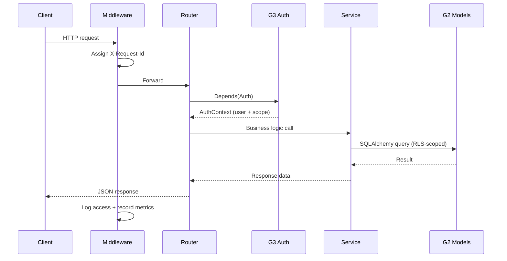

# API Core — "Building's front lobby — routes in, plumbing for everyone, lights always on."

> **Well G1** of 7. See [Gravity Wells Index](README.md) for the full map.

> FastAPI entry + config + DB session + routes + observability. The stage.

**Paths:** `backend/app/main.py`, `backend/app/config.py`, `backend/app/db.py`, `backend/app/middleware.py`, `backend/app/observability.py`, `backend/app/logging.py`, `backend/app/i18n.py`, `backend/app/env_files.py`, `backend/app/api/**`

---

## Purpose

HTTP surface and cross-cutting infrastructure for the gastify backend. Every
inbound request enters through FastAPI routers registered here, authenticated
via [G3 Identity + Ownership](3-identity-ownership.md) dependencies, and served data owned by [G2 Data Model](2-data-model.md). G1 owns the wiring
(CORS, middleware, config, DB session factory, observability) but delegates
domain logic to the wells that own it.

## Files

### Infrastructure (app root)

| File | Role |
|------|------|
| `backend/app/main.py` | FastAPI app factory — registers all routers, CORS middleware, lifespan events. |
| `backend/app/config.py` | `Settings` (Pydantic BaseSettings) — all `GASTIFY_*` env vars: DB URL, Firebase, Gemini, scan provider, debug flags. |
| `backend/app/db.py` | Async SQLAlchemy engine + `async_session` factory + `get_db()` dependency. |
| `backend/app/middleware.py` | `RequestIdMiddleware` (X-Request-Id propagation) + `AccessLogMiddleware` (structured access logs). |
| `backend/app/observability.py` | In-memory Prometheus-compatible metrics registry: `http_requests_total`, `scans_total`, `llm_latency_ms`, `scan_duration_ms`. |
| `backend/app/logging.py` | Structlog setup — JSON to stdout in production, console renderer in dev. |
| `backend/app/i18n.py` | Server-side string registry for `es`/`en`/`pt` translations on API responses. |
| `backend/app/env_files.py` | Local dotenv loader — loads `.env` + `.env.local`, skips production files. |

### API Routers (`backend/app/api/`)

| File | Role |
|------|------|
| `backend/app/api/scans.py` | `POST /scans` — receipt image upload, triggers [G4 Scan Pipeline](4-scan-pipeline.md) `scan_worker.process_scan()` as a background task. |
| `backend/app/api/scan_stream.py` | `GET /scans/{id}/events` (SSE) + `WS /ws/scans/{id}` — real-time scan progress with Firebase JWT auth. |
| `backend/app/api/scan_test_cases.py` | Non-production endpoints for listing/running curated scan test cases. Guarded by environment check. |
| `backend/app/api/transactions.py` | Full CRUD for transactions: list (paginated), get, create, update, delete, batch update/delete. FX conversion on write. |
| `backend/app/api/reference.py` | Read-only endpoints for store and item category taxonomies. |
| `backend/app/api/consent.py` | Consent grant/revoke + audit event listing per G3 Identity requirements. |
| `backend/app/api/privacy.py` | DSR endpoints: data access, rectification, erasure, portability (Law 21.719 CL, GDPR EU, PIPEDA CA, CCPA US-CA). |
| `backend/app/api/push_tokens.py` | Mobile push-token registration/unregistration (Expo, FCM, APNS). |
| `backend/app/api/health.py` | Health check + Alembic migration head validation. |
| `backend/app/api/metrics.py` | Metrics export — JSON (default) or Prometheus text format. Header-authenticated. |

## Key Decisions

### 2026-04-22 — All routers registered in main.py, no lazy loading

Every router is imported and included at app startup in `main.py`. No lazy
loading or conditional registration. Keeps the dependency graph explicit and
debuggable at the cost of a slightly longer cold start. For an MVP with <15
routers this is the right trade-off.

### 2026-05-18 — SSE for web, WebSocket for mobile

`scan_stream.py` exposes both SSE (`/scans/{id}/events`) and WebSocket
(`/ws/scans/{id}`) for scan progress. Web uses SSE (simpler, auto-reconnect
via EventSource). Mobile uses WebSocket (React Native lacks native EventSource,
and the WebSocket path supports bidirectional control messages for cancel).

## Key Diagrams

### Router Registration and Cross-Well Dependencies

```mermaid
flowchart TD
  main["main.py<br/>FastAPI app"] --> cors["CORSMiddleware"]
  main --> reqid["RequestIdMiddleware"]
  main --> acclog["AccessLogMiddleware"]
  main --> scans["api/scans.py<br/>POST /scans"]
  main --> stream["api/scan_stream.py<br/>SSE + WS"]
  main --> txns["api/transactions.py<br/>CRUD /transactions"]
  main --> ref["api/reference.py<br/>GET /reference"]
  main --> consent["api/consent.py<br/>consent lifecycle"]
  main --> privacy["api/privacy.py<br/>DSR endpoints"]
  main --> push["api/push_tokens.py<br/>push registration"]
  main --> health["api/health.py<br/>healthcheck"]
  main --> metrics_ep["api/metrics.py<br/>observability"]

  scans -->|"background task"| g4[["G4 Scan Pipeline"]]
  stream -->|"subscribe events"| g4
  txns -->|"FX + models"| g2[["G2 Data Model"]]
  consent -->|"consent service"| g3[["G3 Identity"]]
  privacy -->|"DSR service"| g3

  classDef infra fill:#eef2f7,stroke:#475467,color:#101828;
  classDef router fill:#e8f1ff,stroke:#1f5fbf,color:#10233f;
  classDef well fill:#e7f6ec,stroke:#1f7a3f,color:#0b2f18;
  class main,cors,reqid,acclog infra;
  class scans,stream,txns,ref,consent,privacy,push,health,metrics_ep router;
  class g2,g3,g4 well;
```

### Request Lifecycle

## Topics (auto-appended)

<!-- /gabe-teach topics appends verified topic summaries here on first run. -->
<!-- Do not edit the structure below this line; edit individual entries freely. -->
