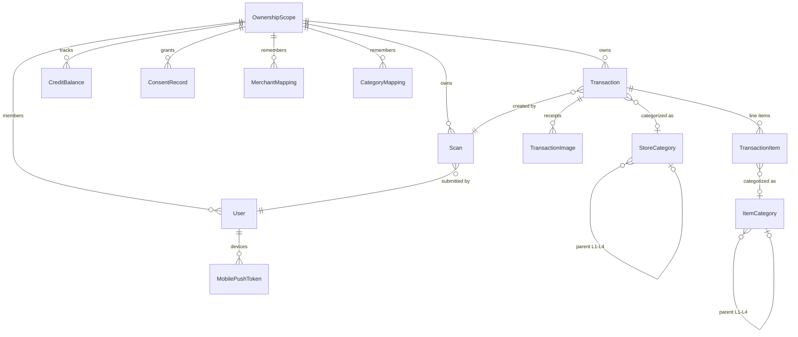
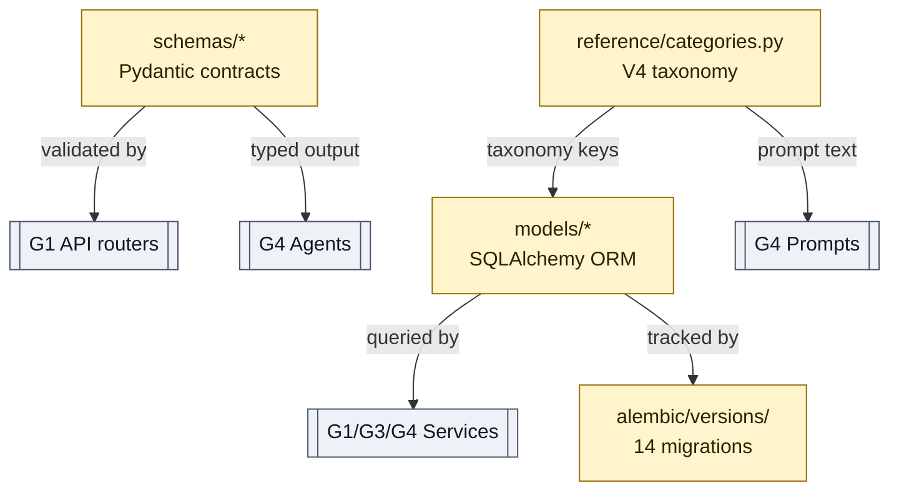

# Data Model — "Warehouse shelves and labels — everything kept, named, findable."

> **Well G2** of 7. See [Gravity Wells Index](README.md) for the full map.

> SQLAlchemy ORM + Pydantic schemas + Alembic migrations. Money/FX/ownership schema invariants.

**Paths:** `backend/app/models/**`, `backend/app/schemas/**`, `backend/alembic/**`, `backend/app/reference/**`

---

## Purpose

Owns the persistent shape of every domain object: ORM tables (SQLAlchemy),
API request/response contracts (Pydantic schemas), migration history (Alembic),
and the canonical V4 category taxonomy (reference data). Other wells depend on
G2 for schema definitions but never bypass it to write raw SQL. Row-Level
Security (RLS) is enforced via `ownership_scope_id` on every tenant table.

## Files

### ORM Models (`backend/app/models/`)

| File | Role |
|------|------|
| `models/__init__.py` | Re-exports all model classes so `Base.metadata` registers them at import time. |
| `models/user.py` | `OwnershipScope`, `User`, `OwnershipScopeMember`, `MobilePushToken` — multi-tenant user hierarchy. Every tenant table FKs to `OwnershipScope`. |
| `models/transaction.py` | `Transaction`, `TransactionItem`, `TransactionImage` — expense records with line items (sort_order, minor-unit amounts), receipt images, and optional recurrence/fixed-term annotations. |
| `models/scan.py` | `Scan` + `ScanStatus` enum (`submitted` → `processing` → `extracted` → `categorized` → `completed` / `failed` / `needs_review`). |
| `models/consent.py` | `ConsentRecord`, `ProcessingRegister`, `AuditEvent` — GDPR/privacy consent and audit trail. Used by [G3 Identity + Ownership](3-identity-ownership.md). |
| `models/credit.py` | `CreditBalance` — per-scope scan credit tracking (BigInteger, default 50). Used by [G3](3-identity-ownership.md) JIT provisioning. |
| `models/fx.py` | `FxRate` — write-once cache keyed by `(rate_date, from_currency, to_currency)`. Used by [G5 Integrations](5-integrations.md) FX service. |
| `models/mapping.py` | `MerchantMapping`, `CategoryMapping` — user-specific remembered merchant/item categorization with confidence scores. Used by [G4 Scan Pipeline](4-scan-pipeline.md) persist step. |
| `models/reference.py` | `Currency`, `StoreCategory`, `ItemCategory` — reference taxonomy tables seeded by migrations. |

### Pydantic Schemas (`backend/app/schemas/`)

| File | Role |
|------|------|
| `schemas/__init__.py` | Package marker. |
| `schemas/common.py` | `CamelModel` (camelCase serialization base), `PaginatedResponse[T]`, `ErrorDetail` — shared across all routers. |
| `schemas/transaction.py` | `TransactionCreate`, `TransactionUpdate`, `TransactionDetail`, `TransactionListItem`, `BatchUpdateRequest`, `BatchDeleteRequest`, `BatchResult`. |
| `schemas/recurrence.py` | Shared recurrence literals and validation helpers for fixed-term and recurring transaction annotations. |
| `schemas/scan.py` | `ScanSubmission`, `GeminiExtractionResult`, `RawGeminiExtractionResult`, `CategorizationResult`, `ScanEvent`, `ScanCompleteData`, `ScanReviewSignal`, `MathReconciliationVerdict` — the full scan pipeline contract. |
| `schemas/consent.py` | `ConsentGrant`, `ConsentResponse`, `DataAccessResponse`, `ErasureResponse`, `PortabilityResponse`, `RectificationRequest`. Jurisdictions: CL, EU, CA, US-CA. |
| `schemas/push_tokens.py` | `PushTokenRegistration`, `PushTokenUnregister`, `PushTokenResponse`. Platform and provider type literals. |
| `schemas/scan_test_cases.py` | `ScanTestCaseSummary`, `ScanTestCaseList`, `ScanTestRunSubmission`. Provider mode: mock / fixture / gemini. |
| `schemas/statement.py` | Credit-card statement extraction contracts plus reconciliation run, verdict, bucket, coverage, fallback-evidence, and usage response shapes (P5 feature). |
| `schemas/statement_profile.py` | Internal fixed row contract and layout-profile structures for unknown statement fallback. |

### Reference Data (`backend/app/reference/`)

| File | Role |
|------|------|
| `reference/__init__.py` | Package marker. |
| `reference/categories.py` | Canonical V4 four-level taxonomy: L1 Industry → L2 Business Type → L3 Family → L4 Category. `render_v4_taxonomy_prompt()` generates prompt text consumed by G4 agents. Also exports `SPANISH_TO_ENGLISH_CATEGORY_KEYS` for key normalization. |

### Migrations (`backend/alembic/versions/`)

| Migration | What it adds |
|-----------|-------------|
| `001_core_tables` | Users, ownership scopes, transactions, items, images, currencies. |
| `002_fx_rates` | FX rate cache table. |
| `003_credits_and_rls` | Credit balance + Row-Level Security policies. |
| `004_consent_dsr` | Consent records, processing register, audit events. |
| `005_scan_metrics` | Scan cost/token tracking columns. |
| `006_scans` | Scan job table with status lifecycle. |
| `007_v4_taxonomy` | V4 category taxonomy seed (store + item categories). |
| `008_english_category_keys` | English key normalization for categories. |
| `009_receipt_discount_fields` | Discount/adjustment columns on transactions. |
| `010_four_level_store_taxonomy` | L1-L4 store category hierarchy. |
| `011_mapping_memory_and_store_provenance` | Merchant/category mapping tables + store provenance. |
| `012_transaction_reconciliation_totals` | Reconciliation total columns for math gate. |
| `013_scan_review_signals` | `scan_review_level` + `scan_review_signals` on transactions. |
| `014_mobile_push_tokens` | Mobile push token table. |
| `015_statement_reconciliation_foundation` | Card aliases, statement records/lines, reconciliation runs/verdicts, and RLS. |
| `016_statement_same_scope_fk_constraints` | Same-scope FK constraints for statement/card-alias ownership boundaries. |
| `017_transaction_recurrence_fields` | Recurrence/fixed-term fields on transactions for receipt and statement-derived annotations. |
| `018_statement_ai_processing_consent` | Statement upload-level AI processing consent audit field. |
| `019_statement_line_fallback_evidence` | Statement-line fallback evidence fields: ledger readiness, source row/page, amount candidates, warnings, and provenance. |
| `020_statement_extraction_usage_metadata` | Statement processing metadata for provider mode, token/cost summaries, fallback reason, cache status, and routing evidence. |

## Key Decisions

### 2026-04-22 — All amounts stored in minor units (integer cents)

Monetary amounts are stored as `BigInteger` minor units (e.g., 1234 = $12.34
for USD, or 1234 = $1,234 for CLP which has zero decimal places). The
`to_minor_units()` helper in `coalesce.py` handles conversion using the
`ZERO_EXPONENT_CURRENCIES` set. Prevents floating-point arithmetic errors.

### 2026-04-22 — ownership_scope_id on every tenant table + RLS

Every table holding user data has an `ownership_scope_id` FK. PostgreSQL
Row-Level Security policies (migration 003) enforce that queries only see
rows matching the session's current scope, set by `auth/deps.py` via
`SET LOCAL`. Defense-in-depth: even a buggy query can't leak cross-tenant data.

### 2026-05-18 — V4 four-level category taxonomy

Categories use L1 Industry → L2 Business Type → L3 Family → L4 Category,
defined in `reference/categories.py` and seeded by migrations 007-010. Both
item and store categories share this structure. Prompt text for [G4](4-scan-pipeline.md) agents is
rendered from this canonical source so taxonomy changes propagate everywhere.

### 2026-05-27 — Statement fallback evidence is persisted with ledger safety

Statement lines now carry enough normalized evidence to explain whether a row is
safe for reconciliation or candidate creation: row/page index, ledger readiness,
amount candidates, selected amount reason, warnings, and provenance. This keeps
unknown-layout Gemini fallback output auditable without storing raw PDFs,
passwords, or raw extracted statement text.

## Key Diagrams

### Entity Relationships

### File Dependency Flow

## Topics (auto-appended)

<!-- /gabe-teach topics appends verified topic summaries here on first run. -->
<!-- Do not edit the structure below this line; edit individual entries freely. -->
