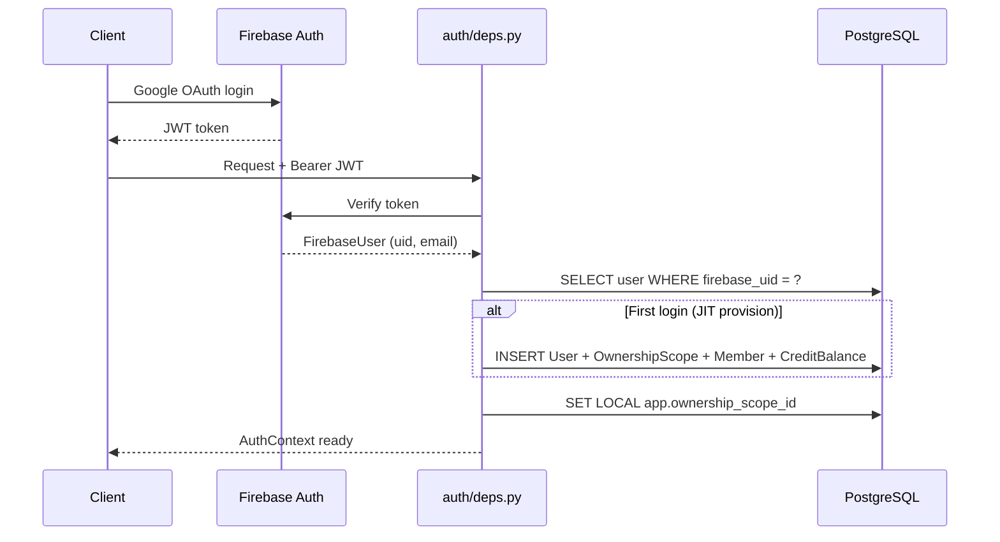
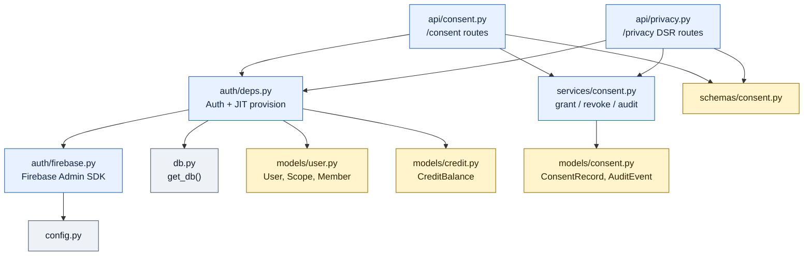

# Identity + Ownership — "Badge-reader at every door — who you are, what you can touch."

> **Well G3** of 7. See [Gravity Wells Index](README.md) for the full map.

> Firebase auth + JIT provisioning + `ownership_scope` + consent/processing register (4-jurisdiction).

**Paths:** `backend/app/auth/**`, `backend/app/services/consent.py`, `backend/app/api/consent.py`, `backend/app/api/privacy.py`

---

## Purpose

Controls who can access what. Firebase handles authentication (Google OAuth
tokens), and G3 translates that into an `AuthContext` with an
`ownership_scope_id` that scopes every database query via RLS. On first login,
JIT provisioning creates user + scope + membership + credit rows in one
transaction. The consent subsystem tracks per-purpose grants and supports
Data Subject Requests across four jurisdictions.

## Files

### Auth Core (`backend/app/auth/`)

| File | Role |
|------|------|
| `auth/__init__.py` | Package marker. |
| `auth/firebase.py` | Firebase Admin SDK singleton (`_get_firebase_app()`). Validates JWT tokens from clients. Exports `CurrentUser` and `FirebaseUser` types. Depends on `config.settings` for project ID and credentials path. |
| `auth/deps.py` | FastAPI dependency `Auth` — resolves Firebase token → `AuthContext` (user record + `ownership_scope_id`). Calls `SET LOCAL app.ownership_scope_id` to activate PostgreSQL RLS for the session. JIT-provisions `User`, `OwnershipScope`, `OwnershipScopeMember`, and `CreditBalance` on first login. |

### Consent + Privacy

| File | Role |
|------|------|
| `services/consent.py` | Business logic: `grant_consent()`, `revoke_consent()`, `list_consents()`, `list_audit_events()`, `get_processing_purpose()`, `anonymize_user_profile()`. Writes to G2 consent/audit tables. |
| `api/consent.py` | Router `/consent` — grant, revoke, list consents, list audit events. Thin HTTP layer over `services/consent.py`. |
| `api/privacy.py` | Router `/privacy` — DSR endpoints: `POST /access` (data export), `PATCH /rectify`, `DELETE /erase`, `GET /portability`. Covers Law 21.719 (CL), GDPR (EU), PIPEDA (CA), CCPA/CPRA (US-CA). |

### Cross-well Dependencies (owned by [G2 Data Model](2-data-model.md), consumed here)

| File | Relationship |
|------|-------------|
| `models/user.py` | [G2](2-data-model.md) owns the schema; G3 reads/writes via `auth/deps.py` JIT provisioning. |
| `models/consent.py` | [G2](2-data-model.md) owns the schema; G3 reads/writes via `services/consent.py`. |
| `models/credit.py` | [G2](2-data-model.md) owns the schema; G3 provisions initial balance (50 credits) on first login. |
| `schemas/consent.py` | [G2](2-data-model.md) owns the contract; G3 uses for request/response validation. |

## Key Decisions

### 2026-04-22 — JIT provisioning on first authenticated request

No separate registration flow. When `auth/deps.py` receives a valid Firebase
token for an unknown user, it creates `User` + `OwnershipScope` +
`OwnershipScopeMember` + `CreditBalance(50)` in a single transaction. Keeps
the auth dependency self-contained.

### 2026-04-22 — RLS via SET LOCAL per request

Every authenticated request calls `SET LOCAL app.ownership_scope_id = <id>`
on the database session. PostgreSQL RLS policies (migration 003) filter all
queries to the current scope. Defense-in-depth: even if application code omits
a WHERE clause, the database enforces tenant isolation.

### 2026-04-22 — Four-jurisdiction consent model

Consent is tracked per-purpose (not blanket) with jurisdiction metadata.
Supported: CL (Law 21.719), EU (GDPR), CA (PIPEDA), US-CA (CCPA/CPRA). DSR
endpoints honor jurisdiction-specific requirements (e.g., EU erasure includes
right to be forgotten; CL includes data portability).

## Key Diagrams

### Authentication Flow

### File Codependency

## Topics (auto-appended)

<!-- /gabe-teach topics appends verified topic summaries here on first run. -->
<!-- Do not edit the structure below this line; edit individual entries freely. -->
