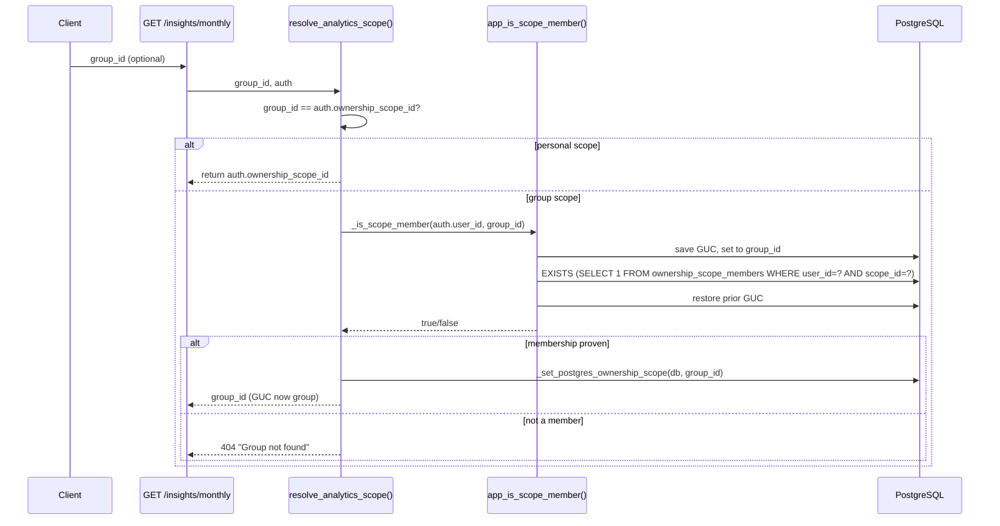
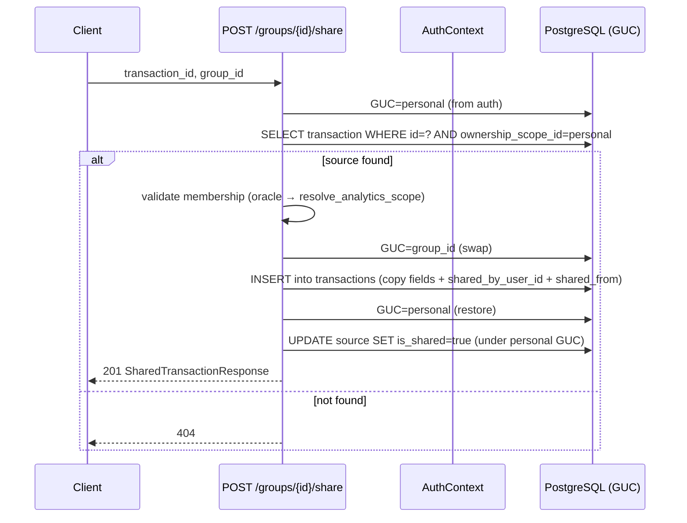
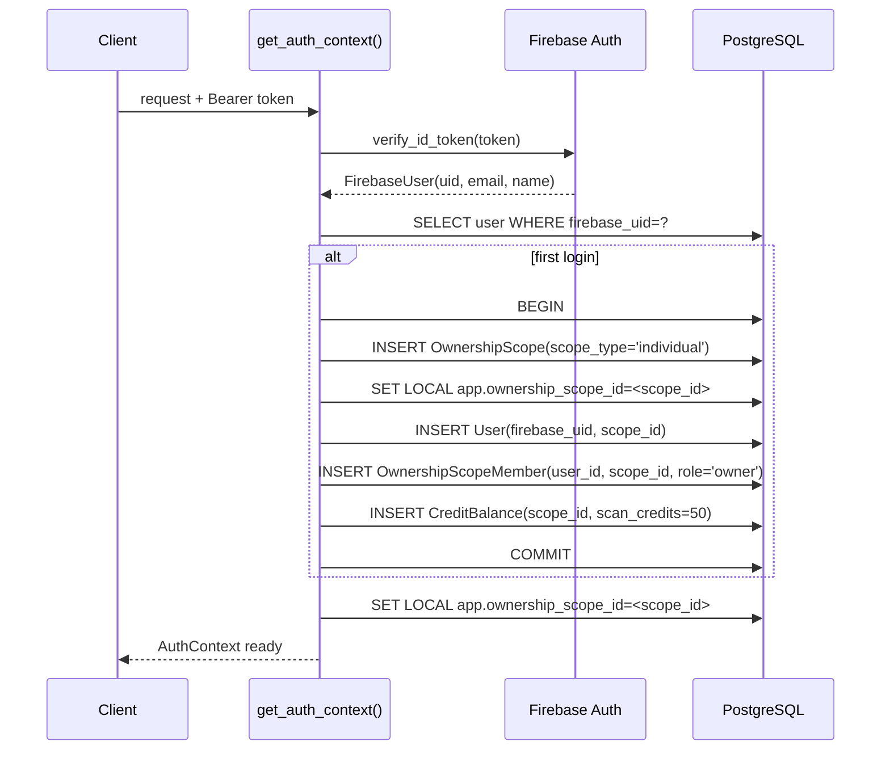

# Identity + Ownership — "Badge-reader at every door — who you are, what you can touch."

> **Well G3** of 7. See [Gravity Wells Index](README.md) for the full map.

> Firebase auth + JIT provisioning + `ownership_scope` + consent/processing register (4-jurisdiction).

**Paths:** `backend/app/auth/**`, `backend/app/services/consent.py`, `backend/app/api/consent.py`, `backend/app/api/privacy.py`

---

## Purpose

Identity + Ownership is the authentication and multi-tenant authorization spine of Gastify. It translates Firebase authentication (Google OAuth) into an AuthContext with an ownership_scope_id that scopes every database query via PostgreSQL RLS. On first login, JIT provisioning creates user + personal scope + membership + credit rows in one transaction. Groups (Phase 5) extend the model: an OwnershipScope can be "group"-typed and shared via invite-links; RLS scope-swapping (validated by a SECURITY DEFINER oracle) lets members read/write shared data while keeping personal isolation intact. The consent subsystem tracks per-purpose data processing grants and supports Data Subject Requests across four jurisdictions (Chile Law 21.719, GDPR, PIPEDA, CCPA/CPRA).

## Key Components

### Auth Core (backend/app/auth/)

| File | Role |
|------|------|
| `firebase.py` | Firebase Admin SDK singleton (`_get_firebase_app()`). Validates JWT tokens via `get_current_user(request)`, returns `FirebaseUser` (uid, email, name). Depends on config.settings for project ID + credentials path. |
| `deps.py` | FastAPI dependency `Auth` — resolves Firebase token → AuthContext (user record + ownership_scope_id). JIT-provisions User + OwnershipScope + OwnershipScopeMember + CreditBalance on first login. Sets transaction-local `app.ownership_scope_id` GUC via `_set_postgres_ownership_scope()`. Exports helpers `resolve_analytics_scope()` (scope-swap with validation + anti-enumeration 404) and `_is_scope_member()` (oracle or direct query). |

### Data Models (backend/app/models/)

| File | Tables |
|------|--------|
| `user.py` | `OwnershipScope` (id, scope_type ∈ {individual, household, group}, name, invite_token/expires_at, member_visibility_enabled, shares_detail, icon/color for avatar), `User` (firebase_uid, email, display_name, ownership_scope_id FK, default_currency, locale), `OwnershipScopeMember` (ownership_scope_id + user_id, role ∈ {owner, admin, member}, shares_detail opt-in). |
| `consent.py` | `ConsentRecord` (user_id, purpose, status ∈ {granted, revoked}, legal_basis, jurisdiction, granted_at, revoked_at, withdrawn_at), `ProcessingRegister` (purpose, description, data_categories, recipients, retention_period, jurisdictions), `AuditEvent` (ownership_scope_id, user_id, event_type, resource_type/id, details, ip_address). |

### Consent + Privacy (backend/app/{services,api}/)

| Endpoint | Role |
|----------|------|
| `services/consent.py` | `grant_consent()`, `revoke_consent()`, `list_consents()`, `list_audit_events()`, `get_processing_purpose()`, `anonymize_user_profile()`, `revoke_all_consents()`. Implements consent propagation for AI training + cohort data-sharing. |
| `api/consent.py` | `/consent` router — GET (list), POST `/{purpose}/grant` (validate purpose, capture IP/UA), POST `/{purpose}/revoke`. |
| `api/privacy.py` | `/privacy` router — DSR endpoints: GET `/data-access` (export per Law 21.719 / GDPR Art 15 / PIPEDA / CCPA), POST `/rectification`, POST `/erasure` (hard-delete + revoke all — D89, amends D4), GET `/portability` (JSON/CSV export). |

### Groups CRUD (backend/app/api/groups.py)

| Endpoint | Role |
|----------|------|
| `GET /groups` | List groups the caller belongs to (via app_user_groups SECURITY DEFINER). Returns id, name, role, member_count, icon/color. |
| `POST /groups` | Create a new group scope (name). Caller is owner. Capped at 5 groups/user. |
| `GET /groups/{id}` | Group detail — name, members + roles, member_visibility_enabled, viewer's shares_detail, icon/color. Validates membership first (404 if non-member). |
| `PATCH /groups/{id}` | Rename (owner/admin). |
| `PATCH /groups/{id}/icon` | Set emoji + color avatar (owner/admin). |
| `POST /groups/{id}/consent` | Member sets their own shares_detail flag (opt-in to detail visibility). |
| `PATCH /groups/{id}/visibility` | Admin toggles member_visibility_enabled (request for detail opt-in). |
| `GET /groups/{id}/transactions` | List group's shared transactions, consent-gated: own rows always, others' if visibility_enabled + current member + shares_detail. Departed contributors hidden. |
| `POST /groups/{id}/share` | Copy one of the caller's personal transactions into the group. Reads source under personal GUC, validates membership, swaps to group scope, inserts copy, locks source. |
| `POST /groups/{id}/invite` | Owner/admin creates invite token (7-day expiry). |
| `POST /invites/{token}/join` | Join a group by token (idempotent, error if expired/full/already-member/at-group-cap). |
| `DELETE /groups/{id}` | Owner deletes group + all transactions + members. |
| `DELETE /groups/{id}/members/{user_id}` | Owner/admin removes member (or any member leaves). Departed members' shares stay in stats. |
| `PATCH /groups/{id}/members/{user_id}` | Update member role (owner/admin, capped 3 admins/group). |

### RLS Policies (alembic/versions/)

| Migration | Policy |
|-----------|--------|
| `003_credits_and_rls.py` | FORCE RLS on transactions, merchant_mappings, category_mappings, credit_balances, transaction_items, transaction_images, ownership_scope_members. Policy: `ownership_scope_id = current_setting('app.ownership_scope_id')::uuid`. |
| `027_rls_policies_missing_ok_guc.py` | Wraps GUC reads as `NULLIF(current_setting(..., true), '')::uuid` (safe NULL-coalesce restore). |
| `028_group_scope_membership_oracle.py` | `app_is_scope_member(p_user_id, p_scope_id) RETURNS boolean` — SECURITY DEFINER, owned by gastify_migrator, EXECUTE to gastify_app. Validates membership for scope-swap gate. Widens scope_type CHECK to {individual, household, group}. |
| `029_group_membership_readers_and_invites.py` | `app_user_groups(user_id)`, `app_group_invite_preview(token)` — SECURITY DEFINER readers (owner=migrator, EXECUTE=app). Relaxes ownership_scope_members to ENABLE (not FORCE) RLS so owner-run readers can enumerate. Widens role CHECK to {owner, admin, member}. Adds invite_token columns. |
| `030_transaction_share_provenance.py` | Adds shared_by_user_id (FK users) + shared_from_transaction_id (uuid, not FK). Unique(ownership_scope_id, shared_from_transaction_id) for dedup. |
| `032_group_member_visibility_consent.py` | Adds ownership_scopes.member_visibility_enabled + OwnershipScopeMember.shares_detail (both bool, default false). |
| `033_share_lock_and_group_avatar.py` | Adds transactions.is_shared (locked once shared). Adds ownership_scopes.icon + color (emoji + hex). Backfills is_shared=true for any source that already has a group copy. |

### Startup Guard (backend/app/db.py)

| Function | Role |
|----------|------|
| `assert_least_privilege_role()` | Queries pg_roles for the connected role; refuses to boot if it is superuser or has BYPASSRLS. Durable guard against regression (D67). Skips local + SQLite. |

## Key Decisions

**D67 (2026-06-01) — Least-privilege DB roles + startup guard (P43).**
Non-superuser roles only: gastify_app (runtime, non-owner, NOBYPASSRLS) + gastify_migrator (DDL, non-super, NOBYPASSRLS, owns tables for ALTER TABLE / CREATE POLICY). Startup guard queries pg_roles and refuses to boot on superuser/BYPASSRLS. RLS is defense-in-depth, enforced at DB layer even if app omits WHERE. Proven end-to-end on real Postgres.

**D70 (2026-06-03) — Full Phase 5 Groups model (validate-then-swap).**
Personal ↔ group scope-switch; share-to-group (copy under group GUC); invite-links (7-day token); scanning personal-only; aggregates by default; consent-gated detail (5e). Membership oracle `app_is_scope_member()` (SECURITY DEFINER, owned by migrator) is the only D3-safe cross-scope check (no policy widening, no new GUC). Validate-then-swap gate: membership is proven BEFORE the GUC swaps (unreachable without proof). Non-member/non-existent both return 404 (anti-enumeration).

**D71 (2026-06-03) — Cross-scope membership reads (NO-FORCE RLS + migrator-owned readers).**
Relax ownership_scope_members to `ENABLE` (not `FORCE`) RLS so migrator-owned SECURITY DEFINER functions can read across scopes (the owner is exempt). gastify_app (non-owner) stays fully RLS-isolated. Data tables keep FORCE. No policy widened (D3-safe).

**D72 (2026-06-04) — Departed members' transactions stay in aggregates, hidden from lists.**
When a member leaves, their shared transactions are NOT deleted. Group statistics (monthly/series/tree) keep counting them (automatic: only membership row deleted, transactions untouched). Transaction list filters: `shared_by_user_id == viewer OR (visibility_enabled AND IS CURRENT MEMBER AND shares_detail)`. Dedup: `uq_transactions_scope_shared_from` on (scope, shared_from).

**D73 (2026-06-04) — 5e consent-gated detail (opt-in per member, app-layer filter).**
ownership_scopes.member_visibility_enabled (admin-controlled, default off) + OwnershipScopeMember.shares_detail (per-member opt-in, default decline). List endpoint: `shared_by_user_id == viewer OR (visibility_enabled AND sharer.current_member AND sharer.shares_detail)`. App-layer filter only (no new RLS, no per-viewer state in policies).

**D74 (2026-06-04) — Sharing locks source transaction content (snapshot integrity).**
Once is_shared=True, source's merchant, store category, items, amounts, currency, date, receipt_type, city/country are immutable. Allowed: card pairing, recurrence, personal flags, delete. Enforced in update_transaction (409 on locked fields). Group copy is independent snapshot; changes to source don't propagate.

**D75 (2026-06-04) — Groups get emoji icon + hex color avatar.**
ownership_scopes.icon (emoji, nullable) + color (hex, nullable, default client-side). Set by owner/admin on PATCH /groups/{id}/icon. Returned in GroupSummary + GroupDetail.

## Invariants

- **RLS scope isolation holds:** Every request sets transaction-local `app.ownership_scope_id` GUC (via auth/deps.py, re-applied per transaction by db.py::_reapply_ownership_scope_guc). RLS policy `USING/WITH CHECK ownership_scope_id = current_setting(...)::uuid` filters all scope-bound tables. Startup guard refuses to boot on superuser/BYPASSRLS roles (D67).

- **Validate-then-swap is unreachable without proof:** resolve_analytics_scope() and group endpoints call _is_scope_member() FIRST; only on true does _set_postgres_ownership_scope() execute. Failed check never swaps GUC. Non-member and non-existent group both return 404 (anti-enumeration).

- **JIT provisioning is atomic:** User + OwnershipScope(personal) + OwnershipScopeMember(owner) + CreditBalance(50) in one transaction. IntegrityError rolls back and retries SELECT (idempotent).

- **Shared transactions are immutable snapshots:** Once is_shared=True, source content fields locked. Group copy is independent; changes to source don't propagate.

- **Cross-scope membership reads are owner-only:** SECURITY DEFINER functions (app_user_groups, app_group_invite_preview) owned by migrator, EXECUTE to gastify_app. Every parameterized call (user_id, token); never SELECT * egress. No policy widened (D3-safe).

- **Departed members' transactions in aggregates, hidden from lists:** DELETE ownership_scope_members does NOT delete transactions. RLS admits all group-scope rows for aggregates. List filters by current membership + shares_detail.

- **Group invites expire:** invite_token_expires_at checked on join/preview; expired returns 410 (GONE).

- **Consent is per-purpose, jurisdiction-specific:** ConsentRecord per-purpose + jurisdiction + legal_basis. Revoked (system) ≠ withdrawn (user, Art 7(3) GDPR). DSR endpoints jurisdiction-gated.

- **Membership caps enforced app-layer:** 5 groups/user, 50 members/group, 3 admins/group. Role checks: owner/admin mutate. Owner cannot leave if last admin (ENTITIES invariant). Concurrent join serialized via FOR UPDATE.

## Flow: Scope-Swap (D70 validate-then-swap)

## Flow: Share-to-Group (D70 read-personal, write-group)

## Flow: JIT Provisioning

