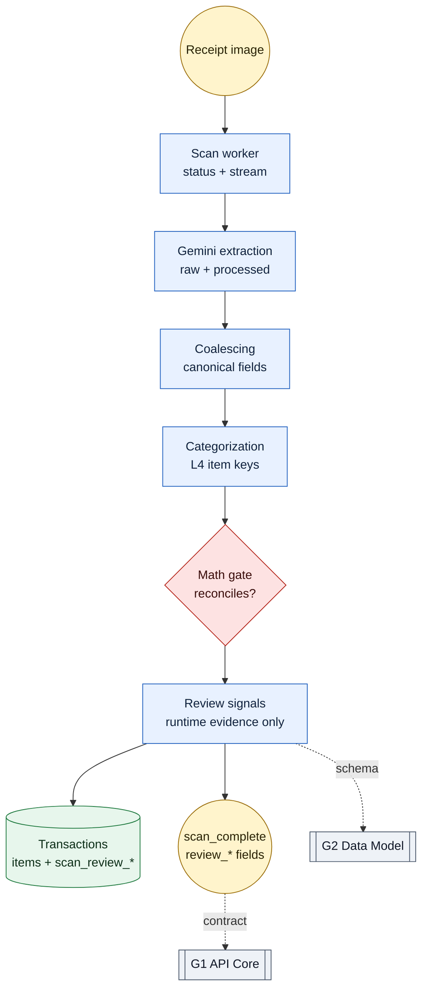

# Scan Pipeline — "Receipt translator — photo in, line-items out, hallucinations caught at gate."

> Vision LLM (Gemini) → guardrails → two-stage extraction → V4 categorizer → math-reconciliation gate → streaming. Core differentiator.

**Paths:** `backend/app/agents/**`, `backend/app/services/scan*`, `backend/app/services/coalesce.py`, `backend/app/services/math_gate.py`, `backend/app/prompt_lab/**`, `backend/tests/test_scan*`, `backend/tests/test_prompt_lab.py`

<!-- Standards: see ~/.claude/skills/gabe-docs/SKILL.md (CommonMark + Mermaid + analogy-first) -->

---

## Purpose

G4 owns the receipt scan path: image extraction, deterministic cleanup,
categorization, math reconciliation, prompt-lab evidence, and runtime review
signals. The well exists to keep AI uncertainty contained behind typed
contracts instead of letting prompt behavior leak directly into the ledger or
UI.

## Key Decisions

### 2026-05-20 — Review warnings stay in G4 unless they become contracts

Runtime scan warnings are computed in one helper inside the scan pipeline from
raw extraction, processed extraction, and the math verdict. The helper does not
depend on prompt-lab baselines because live scans have no expected receipt.

The only cross-well touches are real contracts: G2 Data Model stores
`scan_review_level` and `scan_review_signals` on transactions, and G1 API Core
exposes those fields through `scan_complete` plus transaction list/detail
responses.

### 2026-05-20 — Receipt order remains the canonical correction view

`TransactionItem.sort_order` remains the load-bearing item order for comparing
the extracted list against the receipt image. Category grouping is a secondary
view over the same rows, not a replacement for receipt order.

## Key Diagrams

## Gravity Boundaries

| Boundary | Rule |
| --- | --- |
| G4 default | Keep orchestration, coalescing, math, prompt-lab evidence, and review-signal computation here. |
| G2 crossing | Only for persisted schema/transaction columns. |
| G1 crossing | Only for API and stream payload contracts. |
| Split rule | Add helpers only when they reduce real complexity. The current review-signal pass adds one helper and does not split `coalesce.py`. |

## Topics (auto-appended)

<!-- /gabe-teach topics appends verified topic summaries here on first run. -->
<!-- Do not edit the structure below this line; edit individual entries freely. -->
