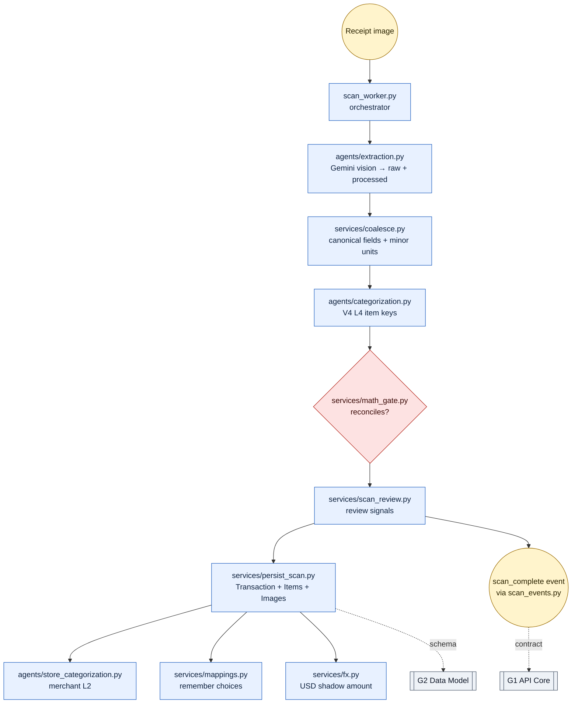
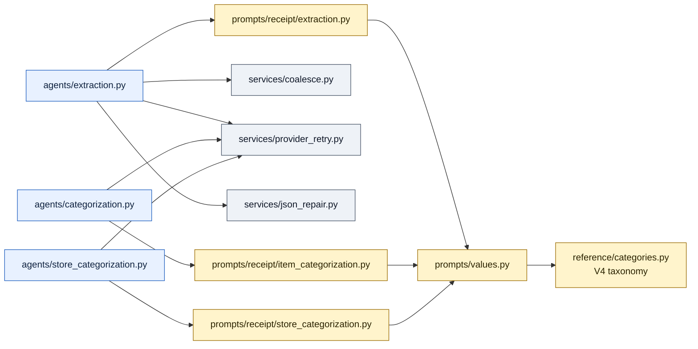

# Scan Pipeline — "Receipt translator — photo in, line-items out, hallucinations caught at gate."

> **Well G4** of 7. See [Gravity Wells Index](README.md) for the full map.

> Vision LLM (Gemini) → guardrails → two-stage extraction → V4 categorizer → math-reconciliation gate → streaming. Core differentiator.

**Paths:** `backend/app/agents/**`, `backend/app/services/scan*`, `backend/app/services/coalesce.py`, `backend/app/services/math_gate.py`, `backend/app/services/image.py`, `backend/app/services/json_repair.py`, `backend/app/services/llm_costs.py`, `backend/app/services/provider_retry.py`, `backend/app/services/receipt_validation_policy.py`, `backend/app/services/persist_scan.py`, `backend/app/services/mappings.py`, `backend/app/services/scan_review.py`, `backend/app/prompts/**`, `backend/app/prompt_lab/**`, `backend/app/reference/**`

---

## Purpose

G4 owns the receipt scan path: image extraction, deterministic cleanup,
categorization, math reconciliation, prompt-lab evidence, and runtime review
signals. The well exists to keep AI uncertainty contained behind typed
contracts instead of letting prompt behavior leak directly into the ledger or
UI.

Credit-card statement scanning is adjacent but separate. Its PDF ingestion,
statement-line extraction, statement-to-receipt matching, and statement-only
transaction candidates are documented in `prompt-testing/STATEMENT-PIPELINE.md`
and implemented through the `statement_*` services rather than the receipt
coalescing/math-gate path.

## Files

### Pipeline Orchestration

| File | Role |
|------|------|
| `services/scan_worker.py` | Main pipeline orchestrator. Status flow: SUBMITTED → PROCESSING → EXTRACTED → CATEGORIZED → COMPLETED / NEEDS_REVIEW / FAILED. Calls extraction → categorization → math gate → persist in sequence, emitting events at each stage. |
| `services/scan_events.py` | In-memory pub/sub dispatcher. `emit()` fans out `ScanEvent` objects to SSE/WebSocket subscribers per scan ID. |
| `services/scan_errors.py` | `ScanErrorCode` enum + `classify_error()` — categorizes failures as transient (retry) or permanent (abort). `PermanentScanError` exception. |
| `services/scan_providers.py` | Provider abstraction: `active_scan_provider()` returns `fixture`, `gemini`, or `mock`. `mock_case_for_scan()` selects deterministic local fixtures by filename. |

### AI Agents (`backend/app/agents/`)

| File | Role |
|------|------|
| `agents/extraction.py` | **Stage 1** — PydanticAI vision agent. Sends receipt image to Gemini, receives `GeminiExtractionResult`, applies `coalesce_extraction()` + `json_repair`. Uses `provider_retry` for transient failures. |
| `agents/categorization.py` | **Stage 2** — PydanticAI text-only agent. Maps extracted line items to V4 L4 taxonomy categories. Text-only call (no image re-send) for cost and security. |
| `agents/store_categorization.py` | **Stage 3** — PydanticAI text-only agent. Maps merchant name to V4 L2 Business Type using item categories as evidence. Called during persistence. |
| `agents/usage.py` | Compatibility helper for extracting token usage from PydanticAI result objects across API shape variations. |

### Post-Processing Services

| File | Role |
|------|------|
| `services/coalesce.py` | Output normalization: `coalesce_extraction()` canonicalizes field names/types. `to_minor_units()` converts decimals to integer cents respecting `ZERO_EXPONENT_CURRENCIES`. `find_visible_total_candidates()` for math-gate input. |
| `services/math_gate.py` | `reconcile()` — validates sum(line_items) + tax - discount == total within tolerance. Returns `MathReconciliationVerdict`. Uses `receipt_validation_policy` thresholds. |
| `services/scan_review.py` | `build_scan_review_signals()` — generates user-review hints from raw extraction, processed extraction, and math verdict. Flags suspicious scans before persistence. |
| `services/persist_scan.py` | `persist_scan_result()` — creates `Transaction` + `TransactionItem` + `TransactionImage` rows from pipeline output. Calls store categorization agent, FX conversion, merchant/item mapping memory. |
| `services/image.py` | `compress_receipt_image()` (1200x1600 JPEG 80%) + `compress_thumbnail()` (120x160 JPEG 70%). Pillow-based with EXIF strip and auto-rotate. |
| `services/json_repair.py` | `repair_json()` — recovers valid JSON from malformed Gemini output (markdown fences, unquoted keys, trailing commas, comments). |
| `services/llm_costs.py` | `estimate_llm_cost_usd()` — token pricing lookup per model from `MODEL_PRICING_USD_PER_1M`. |
| `services/provider_retry.py` | `retry_provider_call()` — exponential backoff retry with transient/permanent error classification for AI API calls. |
| `services/receipt_validation_policy.py` | `ReceiptValidationPolicy` dataclass (version `2026-05-20.v1`) — centralized thresholds for math gate and reconstruction discrepancy checks. |
| `services/mappings.py` | `remember_merchant_mapping()`, `remember_item_mapping()`, `batch_lookup_*()` — persistent user memory for merchant/item categorization shortcuts. |

### Scan Testing Infrastructure

| File | Role |
|------|------|
| `services/scan_test_cases.py` | `list_scan_test_cases()`, `get_scan_test_case()` — curated non-production test case catalog from `fixtures/scan-test-cases/`. |
| `services/scan_e2e_fixtures.py` | `E2EScanFixtureCase` dataclass + `write_upload_hash_marker()` — deterministic fixtures for physical-device E2E testing. |
| `services/statement_extraction.py` | Statement PDF inspection/extraction provider boundary for codex-text and deterministic fixture modes. |
| `services/statement_worker.py` | Statement extraction worker: PDF status handling, normalized line persistence, progress events, and reconciliation kickoff. |
| `services/statement_reconciliation.py` | Deterministic statement-to-receipt matcher: date/amount/merchant/card-alias tolerance, idempotent persisted verdicts, buckets, and coverage metric. |
| `services/statement_events.py` | In-memory statement progress dispatcher for SSE subscribers. |

### Prompt System (`backend/app/prompts/`)

| File | Role |
|------|------|
| `prompts/__init__.py` | Prompt registry interface: `get_prompt()`, `active_prompt_version()`, `list_prompts()`. |
| `prompts/definitions.py` | `PromptKind` enum (receipt-extraction, statement-extraction, item-categorization, store-categorization), `PromptStatus`, `PromptDefinition` dataclass. |
| `prompts/registry.py` | `PROMPTS` tuple of all definitions. `get_prompt()`, `is_prompt_id_allowed()`, `prompt_text_hash()`. |
| `prompts/receipt/extraction.py` | Receipt extraction system prompt (`RECEIPT_EXTRACTION_CURRENT`) with currency/amount formatting rules. |
| `prompts/receipt/item_categorization.py` | Item categorization system prompt (`ITEM_CATEGORIZATION_CURRENT`) referencing V4 taxonomy. |
| `prompts/receipt/store_categorization.py` | Store categorization system prompt (`STORE_CATEGORIZATION_CURRENT`) for merchant L2 assignment. |
| `prompts/statement/extraction.py` | Credit card statement extraction prompt (`STATEMENT_EXTRACTION_CURRENT`) for P5 feature. |
| `prompts/values.py` | Shared prompt variables: `SUPPORTED_RECEIPT_CURRENCY_CODES`, `ZERO_DECIMAL_RECEIPT_CURRENCY_CODES`. Re-exports taxonomy rendering from `reference/categories.py`. |

### Prompt Lab (`backend/app/prompt_lab/`)

| File | Role |
|------|------|
| `prompt_lab/__init__.py` | Package marker. |
| `prompt_lab/__main__.py` | CLI entrypoint for `python -m app.prompt_lab`. |
| `prompt_lab/cli.py` | Argparse CLI: subcommands for case listing, running, importing, statement reports, batch reporting. |
| `prompt_lab/receipt/runner.py` | `run_case()` — executes extraction + categorization on a single receipt case through the production pipeline with caching and scoring. |
| `prompt_lab/receipt/cases.py` | `PromptCase` dataclass + `list_cases()`, `get_case()` — receipt test case discovery and loading. |
| `prompt_lab/receipt/scoring.py` | `score_prompt_run()` — compares actual vs. expected receipt extraction/categorization results. |
| `prompt_lab/receipt/adapter.py` | `load_expected_receipt()` — converts legacy BoletApp baseline JSON to gastify schema for scoring. |
| `prompt_lab/cache.py` | Gemini response cache (schema-versioned) to avoid re-running identical prompts during iteration. |
| `prompt_lab/costs.py` | `build_cost_summary()` — token and cost reporting per prompt-lab run. |
| `prompt_lab/receipt/batch_report.py` | `write_batch_report()` — generates summary from receipt batch test results with promotion thresholds. |
| `prompt_lab/statement/report.py` | `write_statement_expected_report()` — generates the pre-Gemini statement expected-fixture comparison and read-only reconciliation simulation. |
| `prompt_lab/paths.py` | Centralized path constants: `TEST_CASES_ROOT`, `CACHE_ROOT`, `RESULTS_ROOT`, `STATEMENT_TEST_CASES_ROOT`. |
| `prompt_lab/receipt/provenance.py` | `build_field_provenance()` — tracks which receipt extraction fields were modified by post-processing. |
| `prompt_lab/receipt/import_legacy.py` | `import_legacy_cases()` — whitelist importer for legacy BoletApp receipt test assets. |
| `prompt_lab/statement/cases.py` | `StatementCase` dataclass + `import_statement_corpus()`, `list_statement_cases()`, `extract_statement_text()` — PDF statement test case management. |
| `prompt_lab/statement/scoring.py` | `score_statement_output()` — compares actual vs. expected statement extraction. |

## Key Decisions

### 2026-05-20 — Review warnings stay in G4 unless they become contracts

Runtime scan warnings are computed in one helper inside the scan pipeline from
raw extraction, processed extraction, and the math verdict. The helper does not
depend on prompt-lab baselines because live scans have no expected receipt.

The only cross-well touches are real contracts: G2 Data Model stores
`scan_review_level` and `scan_review_signals` on transactions, and G1 API Core
exposes those fields through `scan_complete` plus transaction list/detail
responses.

### 2026-05-20 — Receipt order remains the canonical correction view

`TransactionItem.sort_order` remains the load-bearing item order for comparing
the extracted list against the receipt image. Category grouping is a secondary
view over the same rows, not a replacement for receipt order.

## Key Diagrams

### Pipeline Flow

### Agent Dependency Graph

## Gravity Boundaries

| Boundary | Rule |
| --- | --- |
| G4 default | Keep orchestration, coalescing, math, prompt-lab evidence, and review-signal computation here. |
| [G2](2-data-model.md) crossing | Only for persisted schema/transaction columns. |
| [G1](1-api-core.md) crossing | Only for API and stream payload contracts. |
| [G5](5-integrations.md) crossing | FX service and Firebase auth are G5; G4 calls them as external services. |
| Split rule | Add helpers only when they reduce real complexity. |

## Topics (auto-appended)

<!-- /gabe-teach topics appends verified topic summaries here on first run. -->
<!-- Do not edit the structure below this line; edit individual entries freely. -->
