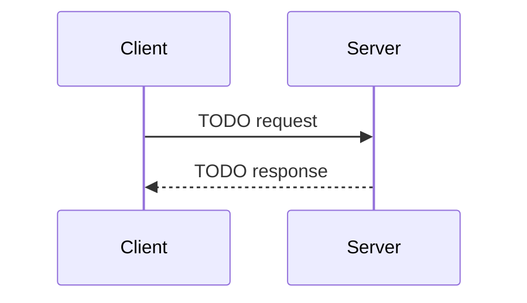

# Integrations — "Diplomatic embassies — each outside service, exactly one doorway we control."

> External adapters — Firebase, Gemini, FX feed, PDF statement parser. Every outside service behind one doorway.

**Paths:** `api/integrations/**`, `tests/api/integrations/**`

<!-- Standards: see ~/.claude/skills/gabe-docs/SKILL.md (CommonMark + Mermaid + analogy-first) -->

---

## Purpose

<!-- 2-3 sentences: what this section of the application does and why it exists. -->
<!-- Populated manually by the human, or auto-appended from verified /gabe-teach topics. -->

## Key Decisions

<!-- Load-bearing choices for this well. Each entry: date + one-line title + 1-2 paragraph rationale. -->
<!-- Example:
### 2026-04-15 — Guardrails run before the LLM, not after
Reasoning: ...
-->

## Key Diagrams

<!-- Suggested diagram type for this well: sequenceDiagram (picked by gabe-docs per-well heuristic) -->
<!-- Replace placeholder with a real diagram once the flow stabilizes. Keep ≤15 nodes. -->

## Topics (auto-appended)

<!-- /gabe-teach topics appends verified topic summaries here on first run. -->
<!-- Do not edit the structure below this line; edit individual entries freely. -->
