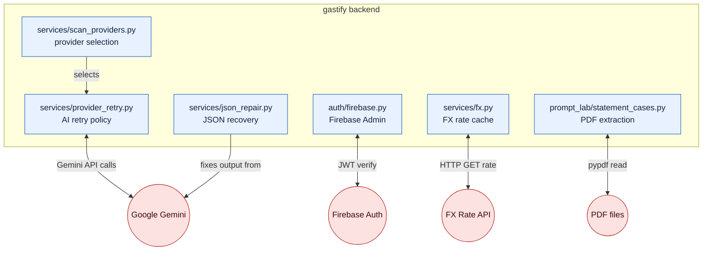
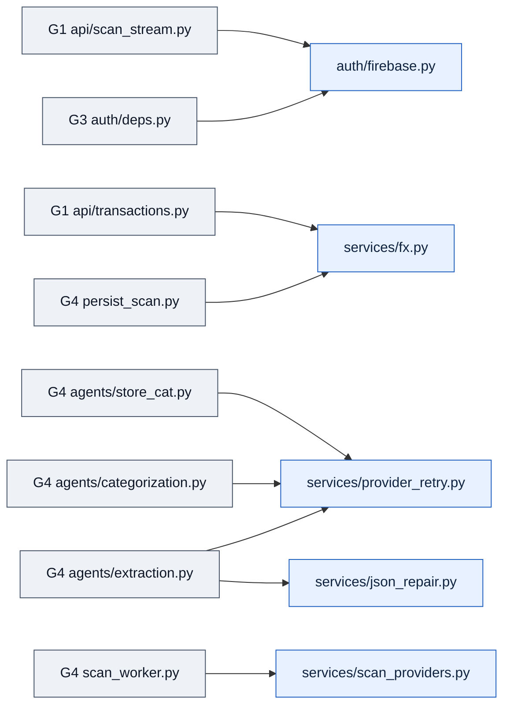

# Integrations — "Diplomatic embassies — each outside service, exactly one doorway we control."

> **Well G5** of 7. See [Gravity Wells Index](README.md) for the full map.

> External adapters — Firebase, Gemini, FX feed, PDF statement parser. Every outside service behind one doorway.

**Paths:** `backend/app/auth/firebase.py`, `backend/app/services/fx.py`, `backend/app/services/provider_retry.py`, `backend/app/services/scan_providers.py`, `backend/app/services/json_repair.py`

---

## Purpose

G5 owns the boundary between gastify and every external service. Firebase for
auth tokens, Gemini for AI extraction, a third-party FX API for currency
rates, and PDF parsing for statement import. Each integration is wrapped in a
single file that other wells import — no well calls an external API directly.
Retry policies, error classification, and response repair live here so
downstream code never handles raw HTTP failures.

**Note:** There is no `integrations/` directory in the current codebase. The
integration logic is distributed across purpose-specific files. This well
tracks those files as a logical grouping — the "one doorway" per external
service.

## Files

| File | External Service | Role |
|------|-----------------|------|
| `auth/firebase.py` | Firebase Admin SDK | Singleton `_get_firebase_app()`. Validates JWT tokens. Exports `CurrentUser`, `FirebaseUser`. The only file that imports `firebase_admin`. |
| `services/fx.py` | FX Rate API | `get_fx_rate()` with lazy read-through DB cache. `compute_usd_shadow()` for USD-equivalent amounts. Exponential backoff retry (`_FX_MAX_RETRIES=3`, `_FX_BASE_DELAY_S`). Wraps the external HTTP call so callers never see raw requests errors. |
| `services/provider_retry.py` | Gemini / AI providers | `retry_provider_call()` — generic exponential backoff with transient/permanent error classification. Used by all three G4 agents (`extraction`, `categorization`, `store_categorization`). |
| `services/scan_providers.py` | Gemini / Mock / Fixture | `active_scan_provider()` — returns the active provider mode (`fixture`, `gemini`, `mock`). `mock_case_for_scan()` — deterministic local fixture selection. Abstracts away which backend actually processes a scan. |
| `services/json_repair.py` | Gemini output | `repair_json()` — recovers valid JSON from malformed LLM responses (markdown fences, unquoted keys, trailing commas, comments). Shields G4 agents from raw Gemini formatting quirks. |
| `prompt_lab/statement_cases.py` | PDF files (pypdf) | `extract_statement_text()` — PDF text extraction via `pypdf.PdfReader`. The only file that imports `pypdf`. |

### Cross-well Consumers

| Integration File | Consumed By |
|-----------------|-------------|
| `auth/firebase.py` | [G3](3-identity-ownership.md) `auth/deps.py`, [G1](1-api-core.md) `api/scan_stream.py` (WebSocket JWT verify) |
| `services/fx.py` | [G4](4-scan-pipeline.md) `services/persist_scan.py`, [G1](1-api-core.md) `api/transactions.py` |
| `services/provider_retry.py` | [G4](4-scan-pipeline.md) `agents/extraction.py`, `agents/categorization.py`, `agents/store_categorization.py` |
| `services/scan_providers.py` | [G4](4-scan-pipeline.md) `services/scan_worker.py`, [G1](1-api-core.md) `api/scan_test_cases.py` |
| `services/json_repair.py` | [G4](4-scan-pipeline.md) `agents/extraction.py` |

## Key Decisions

### 2026-04-22 — No dedicated integrations/ directory

External service wrappers live next to the domain they serve (`auth/` for
Firebase, `services/` for FX and AI provider retry). This avoids an
artificial layer between the domain and the adapter. The trade-off: integration
files are scattered, but each is discoverable from the well that calls it.
This G5 well doc serves as the cross-reference index.

### 2026-04-22 — FX rates cached write-once in PostgreSQL

`services/fx.py` writes each `(date, from, to)` rate to `FxRate` on first
fetch and never updates it. Subsequent requests hit the DB cache. Avoids
external API calls on every transaction save. The cache is per-date, so
historical rates are preserved.

### 2026-05-18 — Provider retry is generic, error classification is per-domain

`provider_retry.py` handles the retry loop (backoff, max attempts). Error
classification (transient vs. permanent) is done by `scan_errors.py` in G4.
This keeps the retry mechanism reusable while letting each domain define what
"transient" means.

## Key Diagrams

### External Service Boundaries

### Who Calls What

## Topics (auto-appended)

<!-- /gabe-teach topics appends verified topic summaries here on first run. -->
<!-- Do not edit the structure below this line; edit individual entries freely. -->
