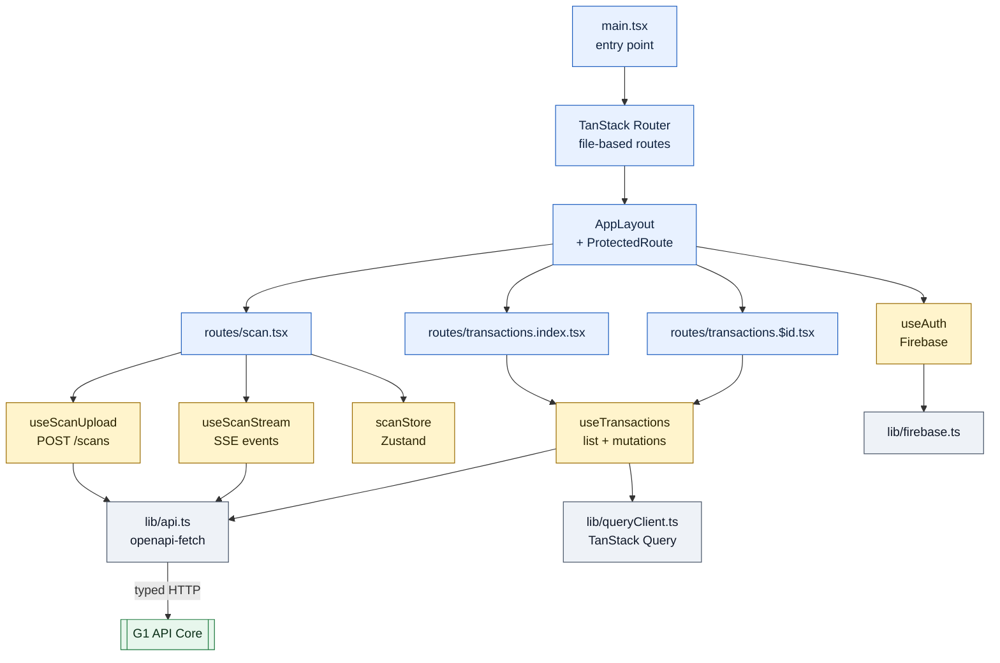
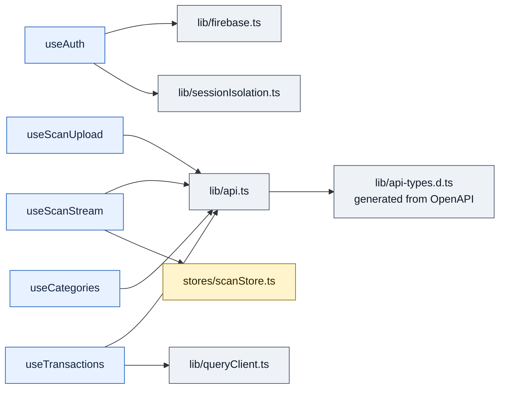

# Web Portal — "Shopfront window — desktop or phone browser, same storefront."

> **Well G6** of 7. See [Gravity Wells Index](README.md) for the full map.

> React 19 + Vite 8 + Zustand + TanStack Router/Query + openapi-fetch. Responsive SPA.

**Paths:** `web/**`

---

## Purpose

Production web SPA connecting to the [G1 API Core](1-api-core.md) FastAPI backend via openapi-fetch typed
client. Handles auth (Firebase Google OAuth), receipt scanning with SSE
streaming progress, and a transaction ledger with paginated list, detail view,
and inline editing. Desktop-first responsive layout with mobile-web support.

## Files

### Entry + Routing (`web/src/`)

| File | Role |
|------|------|
| `src/main.tsx` | App entry point — React 19 + TanStack RouterProvider + QueryClientProvider + Firebase init. |
| `src/routeTree.gen.ts` | Auto-generated route tree from file-based routing (TanStack Router). |
| `src/routes/__root.tsx` | Root layout component — wraps all pages with AppLayout. |
| `src/routes/index.tsx` | Home page — landing / dashboard. |
| `src/routes/sign-in.tsx` | Authentication page — Firebase Google OAuth login. |
| `src/routes/scan.tsx` | Scan page — file upload + SSE streaming progress + result display. |
| `src/routes/transactions.tsx` | Transactions layout wrapper — shared nav for list/detail. |
| `src/routes/transactions.index.tsx` | Transaction list — paginated, filterable, with category breakdowns. |
| `src/routes/transactions.$transactionId.tsx` | Transaction detail — line items, images, inline editing, processing metadata. |

### UI Components (`web/src/components/`)

| File | Role |
|------|------|
| `components/AppLayout.tsx` | Main app wrapper — nav bar, auth guard, responsive container. |
| `components/FileUpload.tsx` | Receipt image upload handler — drag-and-drop + file picker. |
| `components/ProtectedRoute.tsx` | Auth guard — redirects unauthenticated users to sign-in. |
| `components/ScanProgress.tsx` | SSE progress indicator — status steps, animations. |
| `components/ScanResult.tsx` | Scan result display — extracted data preview before save. |
| `components/ScanError.tsx` | Scan error display — differentiated by error type. |

### Hooks (`web/src/hooks/`)

| File | Role |
|------|------|
| `hooks/useAuth.tsx` | Auth state management — Firebase login/logout, token refresh, user context. |
| `hooks/useScanUpload.ts` | File upload logic — multipart form submission to `POST /scans`. |
| `hooks/useScanStream.ts` | SSE streaming — connects to `/scans/{id}/events`, parses `ScanEvent` objects, drives progress UI. |
| `hooks/useTransactions.ts` | Transaction CRUD — TanStack Query mutations with optimistic updates and rollback. Query key factory for cache management. |
| `hooks/useCategories.ts` | Category fetching — loads store/item categories from `/reference`. |
| `hooks/useI18n.ts` | i18n hook — locale detection + translation lookup. |

### State Stores (`web/src/stores/`)

| File | Role |
|------|------|
| `stores/scanStore.ts` | Zustand store for scan session state — current scan ID, phase, progress events. Cleared on navigation. |
| `stores/uiStore.ts` | Zustand store for UI state — sidebar toggle, theme preferences. |

### Utilities (`web/src/lib/`)

| File | Role |
|------|------|
| `lib/api.ts` | openapi-fetch client instance — typed API calls from `api-types.d.ts`. |
| `lib/api-types.d.ts` | Auto-generated TypeScript types from OpenAPI spec (61KB). |
| `lib/openapi-spec.json` | OpenAPI specification (95KB) — source of truth for `api-types.d.ts`. |
| `lib/firebase.ts` | Firebase SDK configuration — project ID, API key, auth domain. |
| `lib/queryClient.ts` | TanStack Query client configuration — default stale time, retry policy. |
| `lib/i18n.ts` | i18n setup — translation tables for es/en, locale detection. |
| `lib/sessionIsolation.ts` | Session security — prevents cross-user cache leakage on logout. |
| `lib/format.ts` | Date/number formatting helpers — locale-aware currency display. |

### Tests (`web/src/`)

| File | Role |
|------|------|
| `hooks/useAuth.test.tsx` | Auth hook unit tests. |
| `hooks/useScanStream.test.tsx` | SSE stream hook tests. |
| `hooks/useScanUpload.test.tsx` | Upload hook tests. |
| `hooks/useTransactions.test.tsx` | Transaction CRUD mutation tests. |
| `lib/i18n.test.ts` | Translation resolution tests. |
| `lib/sessionIsolation.test.ts` | Session isolation tests. |
| `components/scanFlow.test.tsx` | Integration test for full scan flow. |
| `test/webJourney.test.tsx` | Full user journey test — sign-in → scan → view transaction. |

## Key Decisions

### 2026-05-13 — TanStack Query key factory for transaction cache

Query keys use a factory object (`transactionKeys.all/lists/list/details/detail`)
so list invalidation after mutations can target `transactionKeys.lists()` without
blowing away in-flight detail queries. Enables optimistic updates.

### 2026-05-14 — Transaction detail uses `
` for processing metadata

LLM processing stats (scan duration, tokens, cost) are secondary to the receipt
data. Collapsible `
` keeps the primary view clean while making
diagnostics accessible without a separate page.

### 2026-05-14 — Optimistic updates with rollback for inline editing

`useUpdateTransaction` applies PATCH body to the detail cache immediately via
`onMutate`, then rolls back to the snapshot on error via `onError`. `onSettled`
invalidates both the detail and list queries. Click-to-edit components keep
editing state local — no Zustand needed for ephemeral input focus.

## Key Diagrams

### Component and Data Flow

### Hook → Store → API Dependencies

## Topics (auto-appended)

<!-- /gabe-teach topics appends verified topic summaries here on first run. -->
<!-- Do not edit the structure below this line; edit individual entries freely. -->
