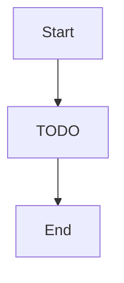

# Web Portal — "Shopfront window — desktop or phone browser, same storefront."

> React + Vite + Zustand + TanStack Query + Ladle. Responsive SPA.

**Paths:** `web/**`, `tests/web/**`

<!-- Standards: see ~/.claude/skills/gabe-docs/SKILL.md (CommonMark + Mermaid + analogy-first) -->

---

## Purpose

Production web SPA connecting to the FastAPI backend via openapi-fetch typed client. Handles auth (Firebase Google OAuth), receipt scanning with SSE streaming progress, and a transaction ledger with paginated list, detail view, and inline editing. Desktop-first responsive layout with mobile-web support.

## Key Decisions

### 2026-05-13 — TanStack Query key factory for transaction cache
Query keys use a factory object (`transactionKeys.all/lists/list/details/detail`) so list invalidation after mutations can target `transactionKeys.lists()` without blowing away in-flight detail queries. Enables optimistic updates in T3.

### 2026-05-14 — Transaction detail uses `
` for processing metadata
LLM processing stats (scan duration, tokens, cost) are secondary to the receipt data. Collapsible `
` keeps the primary view clean while making diagnostics accessible.

## Key Diagrams

<!-- Suggested diagram type for this well: flowchart (picked by gabe-docs per-well heuristic) -->
<!-- Replace placeholder with a real diagram once the flow stabilizes. Keep ≤15 nodes. -->

## Topics (auto-appended)

<!-- /gabe-teach topics appends verified topic summaries here on first run. -->
<!-- Do not edit the structure below this line; edit individual entries freely. -->
