# Mobile App — "Pocket version — native camera, offline-tolerant, same shared backend."

> **Well G7** of 7. See [Gravity Wells Index](README.md) for the full map.

> React Native 0.83 + Expo 55 + React Navigation + TanStack Query + Zustand + Jest. Android + iOS single codebase.

**Paths:** `mobile/**`

---

## Purpose

Native mobile client for Android and iOS, built with Expo/React Native and EAS. Shares the same FastAPI backend as [G6 Web Portal](6-web-portal.md) via an identical OpenAPI-generated type layer. Adds native-only capabilities: camera-based receipt capture, WebSocket scan progress (instead of SSE), secure keystore token storage, and push notifications via Expo/FCM/APNS. Built with EAS for dev, staging, staging-e2e, and production profiles.

## Key Components

| Component | Role |
|-----------|------|
| `App.tsx` + `AppNavigator.tsx` | Root SafeAreaProvider + React Navigation stack; auth guard at navigator level. |
| `AuthProvider.tsx` | Firebase Auth context; Google Sign-In, token refresh, session state, sign-out isolation. |
| Screens (15 total) | SignIn, Home, Transactions, TransactionDetail, Dashboard, Trends, Items, Reports, Groups, GroupDetail, Statements, BatchCapture, BatchReview, Settings. Each scope-aware and query-driven. |
| `scanStore` (Zustand, 6.8KB) | Scan lifecycle: idle→uploading→submitted→processing→extracting→categorizing→verified→complete/failed. Phase, event log, result data, error state, connection status. |
| `scopeStore` (Zustand + SecureStore) | Active scope (personal or group{id,name}). Persisted so group choice survives app restart; reset on sign-out. Implements D70/D72 scope isolation. |
| `sessionStore`, `pushRegistrationStore`, `batchScanStore` | Auth state, push token lifecycle, batch hand-off state. |
| `lib/api.ts` + `lib/api-types.d.ts` | openapi-fetch client; auto-generated types from backend OpenAPI spec. Identical contract to web. |
| `ScanProgressSocket` (6.5KB) | WebSocket client for `/ws/scans/{id}`. Exponential backoff reconnection (1–30s, max 5 retries), terminal event detection, status callbacks. |
| `ProgressFallback` | Hybrid transport: REST poll (`GET /scans/{id}`) engages while WS stalls; auto-disengages on reconnect. |
| `secureAuthToken.ts` + `googleSignIn.ts` | Token persisted to device keystore (WHEN_UNLOCKED_THIS_DEVICE_ONLY); Firebase refresh; Google Sign-In. |
| `pushNotifications.ts` | Expo notification permission, FCM/APNS token retrieval, Android channel setup, registration lifecycle. |
| `useInsights`, `useGroups`, `useTransactions` hooks | TanStack Query wrappers; scope-aware via active scope store; cache invalidation on mutations. |
| `BatchCaptureScreen` + `BatchReviewScreen` | N-scan workflow: hand-off inputs via `batchScanStore`, review is post-persist (status monitor → summary → per-item edit/discard). |
| `StatementsScreen` | PDF upload, WebSocket reconciliation progress, 5 buckets (matched/statement-only/receipt-only/ambiguous/failed). |

## Key Decisions

### D38 (P4-Ph1) — Mobile scaffold + auth = Ent

Native keystore (expo-secure-store) + Firebase Auth + typed API client are non-negotiable. MVP AsyncStorage would leak tokens if device is rooted or app sandbox compromised. Ent baseline is cheaper than retrofitting auth.

### D39 (P4-Ph2) — Camera scan + WebSocket progress = Ent

Native camera/file picker and WebSocket reconnection are core exit-signal behavior. Manual reload after disconnect fails the mobile receipt loop. Hybrid transport (WS primary + REST fallback) handles network loss.

### D40 (P4-Ph3) — Mobile ledger + edit = Ent

Optimistic rollback + user_edited_at precedence preserve REQ-13 when scan completion and manual edits race. TanStack Query cache invalidation is baseline for shared scan/edit state.

### D41 (P4-Ph4) — Sign-out isolation + push registration = Ent

Platform keystore/query/cache/image purge and device token lifecycle are REQ-14/REQ-25 load-bearing. Three-layer eviction: Firebase + native keystore + TanStack Query + Zustand reset.

### D42 (P4-Ph5) — Mobile E2E journey + edge tests = Ent

Device-level proof required for keystore, cache eviction, native camera, WebSocket lifecycle. Maestro is primary runner (Detox fallback). D43 + D47 amendments: S23 physical device (avoids WSL emulator churn), Android only (iOS deferred post-roadmap).

### D43 (P4 amendment) — Android E2E execution pivots to S23 USB

Avoids emulator RAM/CPU competition and ADB instability. Proves native risks: camera permission, SecureStore behavior, app cache eviction, push permission, real device networking.

### D44 (P4 Phase 2D) — Receipt prompt v2-dev.9 accepted with review-warning risks

Correct final totals despite minor item name/category/quantity gaps. Runtime must surface review warnings and preserve receipt order for image comparison.

### D47 (P5 amendment) — iOS runtime testing deferred post-roadmap

Current P5 closure on Android/S23 only. iOS TestFlight infrastructure revisited after P1–P9 roadmap complete. Framework code (Firebase, Expo) supports both; device-level proof pending.

### D52 (P5-Ph6) — Android statement reconciliation flow = Ent

Native file picker, WebSocket progress, cache isolation, S23 runtime proof required. iOS deferred by D47.

### D60 (P6-Ph5) — Android insights + flag review flow = Ent

S23 proves native cache cleanup on sign-out, flag mutation, category drilldowns. Item flags are personal privacy markers; aggregate exclusion does not leak into future shared contexts.

### D62 (Feature-parity P3 batch) — Batch scanning = MVP (N sequential single-scans + GET-poll + post-persist review)

Backend auto-persists each scan into a transaction. Review happens after save (monitor → summary of saved/needs-review/failed → per-item open/edit/discard). GET-poll (not N reconnecting WS streams) keeps batch within MVP tier; Reconnection is Ent (D31/D34).

### D70/D72 (P7 amendments, active in mobile) — Scope isolation + RLS scope-swap

scopeStore (Zustand + SecureStore) holds active scope (personal or group{id,name}). Persisted across restarts; reset on sign-out. Every insights/group/transaction query passes ownership_scope_id; server enforces RLS policies. Personal-only scanning (BatchCapture disabled for groups, D70).

## Invariants

1. **Scope isolation**: Active scope scopes all insights/dashboard/transaction queries. Personal-only scanning. Reset on sign-out prevents leak to next account.
2. **Auth token security**: Firebase tokens in device keystore only (WHEN_UNLOCKED_THIS_DEVICE_ONLY). Cleared on sign-out and app uninstall.
3. **WebSocket resilience**: Scan progress auto-reconnects (1–30s exp backoff, max 5 retries). Terminal events stop client. Hybrid fallback to REST poll bridges stalls.
4. **Optimistic updates**: Transaction edits use TanStack Query optimistic mutations. Rollback on error preserves server as source of truth. user_edited_at precedence across scan completion + manual edit races.
5. **Cache eviction on sign-out**: Keystore token + query client caches + Zustand stores (scan, scope, session, push) + group scope all cleared. No residual local data leaks.
6. **Native permission handling**: Camera denied, push denied, media denied, file validation errors surface graceful UX. No silent failures.
7. **Batch POST-persist review**: Backend auto-persists each scan in batch. Mobile review is post-persist (status monitor → summary → per-item edit/discard/retry).
8. **RLS scope swap**: Every insights/group/transaction query carries ownership_scope_id via auth context. Server enforces row-level security policies.
9. **Test determinism**: Receipt extraction test cases are backend-seeded (happy/review/failure locally; supermarket/restaurant/gas/thousands on staging). E2E auth uses special test credentials configured at build time.

## Screens Navigation and Data Flow

```mermaid
flowchart TD
  app["App.tsx"] --> providers["AppProviders<br/>Auth + Query"]
  providers --> nav["AppNavigator<br/>React Navigation"]
  nav --> signin["SignInScreen"]
  nav --> home["HomeScreen<br/>receipt capture trigger"]
  nav --> txn_list["TransactionsScreen<br/>paginated list"]
  nav --> txn_detail["TransactionDetailScreen<br/>edit + sharing"]
  nav --> dashboard["DashboardScreen<br/>monthly insights"]
  nav --> trends["TrendsScreen<br/>multi-granularity"]
  nav --> items["ItemsScreen<br/>flagged items"]
  nav --> reports["ReportsScreen<br/>period spending"]
  nav --> groups["GroupsScreen<br/>list + invite"]
  nav --> statements["StatementsScreen<br/>PDF reconciliation"]
  nav --> batch_capture["BatchCaptureScreen<br/>N-scan input"]
  nav --> batch_review["BatchReviewScreen<br/>post-persist review"]

  home --> capture["useReceiptCapture<br/>camera picker"]
  home --> upload["useScanUpload<br/>POST /scans"]
  home --> socket["useScanProgressSocket<br/>WebSocket"]
  home --> scan_store["scanStore<br/>Zustand"]

  txn_list --> txn_hook["useTransactions<br/>list + mutations"]
  txn_detail --> txn_hook

  dashboard --> monthly["useMonthlyInsights<br/>with activeScope"]
  dashboard --> scope_banner["ScopeBanner<br/>personal/group switch"]

  trends --> series["useInsightsSeries<br/>multi-granularity"]
  reports --> series

  groups --> group_hook["useGroups<br/>list + mutations"]
  batch_review --> batch_hook["useBatchScan<br/>polling orchestration"]

  upload --> api["lib/api.ts<br/>openapi-fetch"]
  socket --> ws["lib/scanProgressSocket.ts<br/>WebSocket client"]
  txn_hook --> api

  signin --> auth["AuthProvider<br/>Google Sign-In"]
  auth --> secure["lib/secureAuthToken.ts<br/>expo-secure-store"]
  auth --> scope["scopeStore<br/>Zustand + SecureStore"]

  api -->|"typed HTTP"| backend[["G1 API Core"]]
  ws -->|"WebSocket"| backend

  classDef screen fill:#e8f1ff,stroke:#1f5fbf,color:#10233f;
  classDef hook fill:#fff4cc,stroke:#9a6b00,color:#2b2300;
  classDef store fill:#f0e6ff,stroke:#6f42c1,color:#2b1650;
  classDef infra fill:#eef2f7,stroke:#475467,color:#101828;
  classDef external fill:#e7f6ec,stroke:#1f7a3f,color:#0b2f18;
  class app,providers,nav,signin,home,txn_list,txn_detail,dashboard,trends,items,reports,groups,statements,batch_capture,batch_review screen;
  class capture,upload,socket,txn_hook,monthly,series,auth,group_hook,batch_hook hook;
  class scan_store,scope,scope_banner store;
  class api,ws,secure infra;
  class backend external;
```

## Mobile vs. Web Comparison

| Aspect | Mobile (G7) | Web (G6) |
|--------|------------|---------|
| Navigation | React Navigation stack | TanStack Router (file-based) |
| Auth | Firebase Auth + @react-native-google-signin | Firebase Auth SDK (browser) |
| Scan progress | WebSocket `/ws/scans/{id}` with reconnection | SSE EventSource `/scans/{id}/events` |
| Token storage | expo-secure-store (device keystore) | in-memory + sessionStorage isolation |
| File capture | Native ImagePicker (camera/library) | Drag-and-drop + browser FileInput |
| Real-time | Hybrid WS + REST poll fallback | SSE only (browser handles reconnect) |
| Push notifications | Expo Notifications + FCM/APNS registration | Service Worker + Web Push API (N/A for MVP) |
| API types | Auto-generated from OpenAPI spec | Auto-generated from same OpenAPI spec |
| Cache | TanStack Query + Zustand scoped stores | TanStack Query + zustand uiStore |
| Scope isolation | scopeStore (Zustand + SecureStore) | uiStore (Zustand in-memory) |
