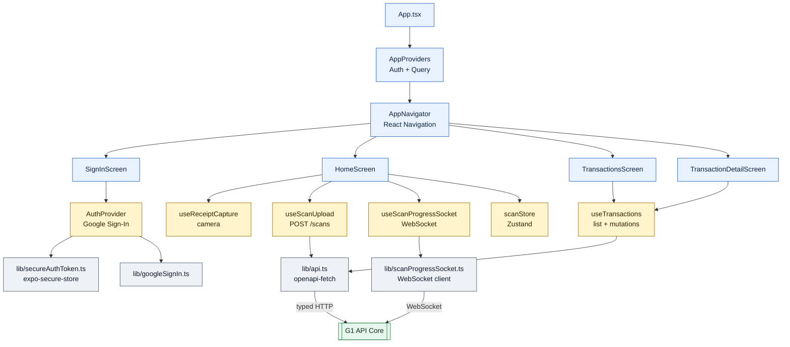
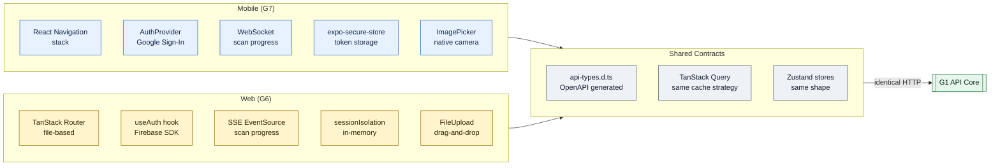

# Mobile App — "Pocket version — native camera, offline-tolerant, same shared backend."

> **Well G7** of 7. See [Gravity Wells Index](README.md) for the full map.

> React Native 0.83 + Expo 55 + React Navigation + TanStack Query + Zustand + Jest. Android + iOS single codebase.

**Paths:** `mobile/**`

---

## Purpose

Native mobile client for Android and iOS, built with Expo/React Native. Shares
the same FastAPI backend as [G6 Web Portal](6-web-portal.md) via an identical OpenAPI-generated
type layer. Adds native-only capabilities: camera-based receipt capture,
WebSocket scan progress (instead of SSE), secure keystore token storage, and
push notifications via Expo/FCM/APNS. Built with EAS for dev, staging, and
production profiles.

## Files

### Entry + Navigation (`mobile/src/`)

| File | Role |
|------|------|
| `src/App.tsx` | Root component — wraps the app in `SafeAreaProvider` + `AppProviders`. |
| `src/index.js` | Expo entry point — registers the root component. |
| `src/navigation/AppNavigator.tsx` | React Navigation stack navigator — defines screen hierarchy (SignIn → Home → Transactions → TransactionDetail). |
| `src/providers/AppProviders.tsx` | Provider tree — composes `AuthProvider` + `QueryClientProvider`. |
| `src/providers/AuthProvider.tsx` | Auth context — Firebase Google Sign-In, token refresh, session state. Wraps auth flow for the entire app. |

### Screens (`mobile/src/screens/`)

| File | Role |
|------|------|
| `screens/SignInScreen.tsx` | Login screen — Google Sign-In button, loading state, error display. |
| `screens/HomeScreen.tsx` | Main dashboard (26KB) — receipt capture trigger, recent scans, credit balance, category breakdown. |
| `screens/TransactionsScreen.tsx` | Transaction list (13KB) — paginated, filterable, pull-to-refresh. |
| `screens/TransactionDetailScreen.tsx` | Single transaction detail (20KB) — line items, images, inline editing, processing metadata. |

### Hooks (`mobile/src/hooks/`)

| File | Role |
|------|------|
| `hooks/useReceiptCapture.ts` | Camera capture — Expo ImagePicker integration for receipt photos. |
| `hooks/useScanUpload.ts` | Upload handler — multipart form submission to `POST /scans` with auth token. |
| `hooks/useScanProgressSocket.ts` | WebSocket progress — connects to `WS /ws/scans/{id}`, parses events, drives scan UI. |
| `hooks/useTransactions.ts` | Transaction CRUD (8.6KB) — TanStack Query mutations, list/detail fetching, optimistic updates. |
| `hooks/useCategories.ts` | Category fetching — loads reference data from `/reference`. |
| `hooks/usePushRegistration.ts` | Push notification registration — Expo token retrieval + `POST /push-tokens`. |

### State Stores (`mobile/src/stores/`)

| File | Role |
|------|------|
| `stores/scanStore.ts` | Zustand store (6.8KB) — scan session lifecycle: idle → uploading → streaming → complete/error. Tracks scan ID, progress events, and result data. |
| `stores/sessionStore.ts` | Session/auth state — current user, token, login status. |
| `stores/pushRegistrationStore.ts` | Push registration state — token, permission status, last registration date. |

### Utilities (`mobile/src/lib/`)

| File | Role |
|------|------|
| `lib/api.ts` | openapi-fetch client instance — typed API calls, identical contract to web. |
| `lib/api-types.d.ts` | Auto-generated TypeScript types from OpenAPI spec, including statement fallback evidence and recurrence fields. |
| `lib/openapi-spec.json` | OpenAPI specification shared with web. |
| `lib/mobileConfig.ts` | Mobile-specific config — API base URL, environment detection, feature flags. |
| `lib/secureAuthToken.ts` | Secure token storage via `expo-secure-store` — persists Firebase token across app restarts. |
| `lib/authSession.ts` | Session management — token refresh, expiry handling, logout cleanup. |
| `lib/googleSignIn.ts` | Google Sign-In setup — `@react-native-google-signin` configuration. |
| `lib/scanUpload.ts` | Low-level upload logic (4.3KB) — multipart construction, progress tracking, retry. |
| `lib/scanProgressSocket.ts` | WebSocket client (6.5KB) — connection lifecycle, reconnection, event parsing. Consumed by `useScanProgressSocket` hook. |
| `lib/scanTestCases.ts` | Test case fetching — loads curated test cases from backend for dev builds. |
| `lib/pushNotifications.ts` | Push notification setup (3.9KB) — Expo notification permissions, token retrieval, channel configuration. |
| `lib/transactions.ts` | Transaction API helpers — list, detail, update, delete wrappers over openapi-fetch. |
| `lib/categories.ts` | Category API helpers — store/item category fetching. |
| `lib/queryClient.ts` | TanStack Query client config — stale time, retry policy (matches web). |
| `lib/format.ts` | Formatting utilities — locale-aware currency display, date formatting. |
| `lib/apiError.ts` | API error handler — typed error parsing from response bodies. |
| `lib/e2eFirebaseAuth.ts` | E2E testing auth — special auth flow for Maestro/Detox test runs. |

### Components (`mobile/src/components/`)

| File | Role |
|------|------|
| `components/ScreenShell.tsx` | Screen wrapper — safe area insets, consistent padding, scroll handling. |

### Types (`mobile/src/types/`)

| File | Role |
|------|------|
| `types/navigation.ts` | React Navigation type definitions — screen param lists for type-safe navigation. |

### Config Files (root)

| File | Role |
|------|------|
| `mobile/app.config.ts` | Expo config — app name, bundle ID, splash screen, EAS project ID, plugins. |
| `mobile/eas.json` | EAS build profiles — dev, staging, staging-e2e, production. |
| `mobile/jest.config.js` | Jest config — React Native preset, module name mapping, setup files. |
| `mobile/GoogleService-Info.plist` | Firebase iOS config. |
| `mobile/google-services.json` | Firebase Android config. |

## Key Decisions

### 2026-05-18 — WebSocket for scan progress (not SSE)

React Native lacks native `EventSource` support. The WebSocket path
(`/ws/scans/{id}`) supports bidirectional messages, enabling cancel-scan
control messages. Web uses SSE because browsers handle reconnection natively.

### 2026-05-18 — Secure token storage via expo-secure-store

Firebase auth tokens are stored in the device keystore (`expo-secure-store`)
rather than AsyncStorage. Prevents token theft if the device is rooted or the
app sandbox is compromised. Token is loaded on app start from secure store
before any API call.

### 2026-05-20 — Shared OpenAPI types between web and mobile

Both `web/src/lib/api-types.d.ts` and `mobile/src/lib/api-types.d.ts` are
generated from the same OpenAPI spec. This guarantees type parity between
clients without a shared npm package. The spec lives in each client's `lib/`
directory and is regenerated when the backend schema changes.

### 2026-05-27 — Android will consume the same statement contracts

The mobile generated API layer now has the P5 statement fallback evidence,
usage metadata, and transaction recurrence fields needed for the Android
statement reconciliation journey. iOS runtime proof remains deferred; Android
and web are the active validation surfaces for the next phases.

## Key Diagrams

### Screen Navigation and Data Flow

### Mobile vs. Web Architecture Comparison

## Topics (auto-appended)

<!-- /gabe-teach topics appends verified topic summaries here on first run. -->
<!-- Do not edit the structure below this line; edit individual entries freely. -->
