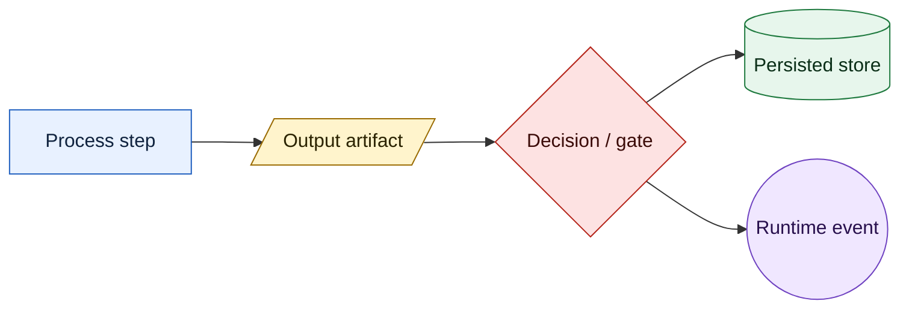
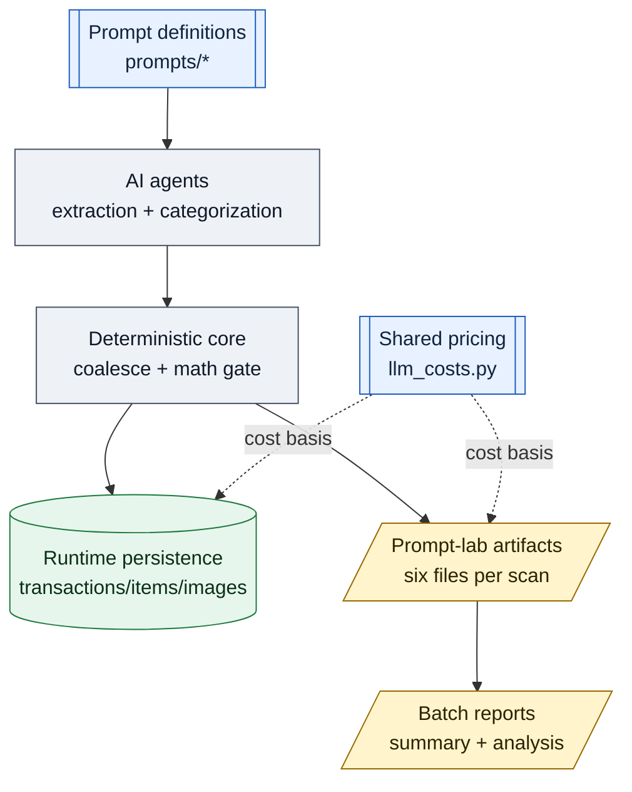
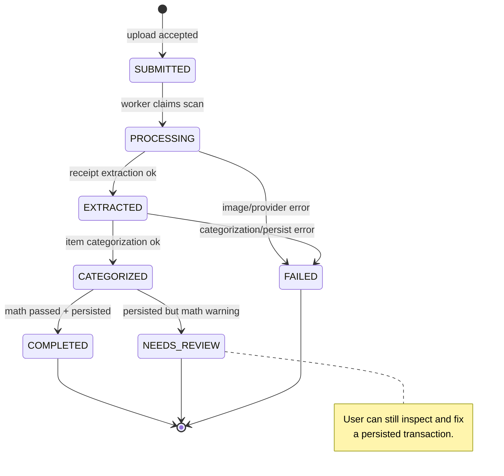
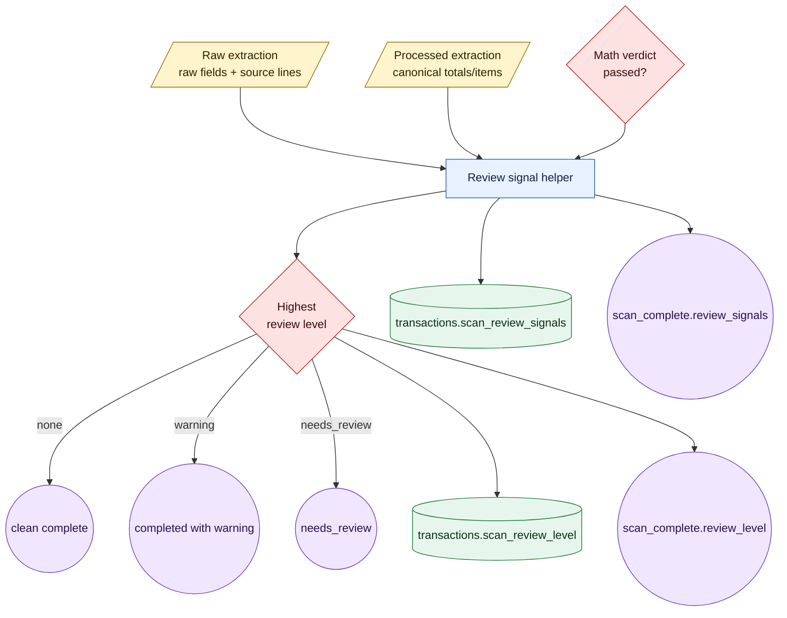
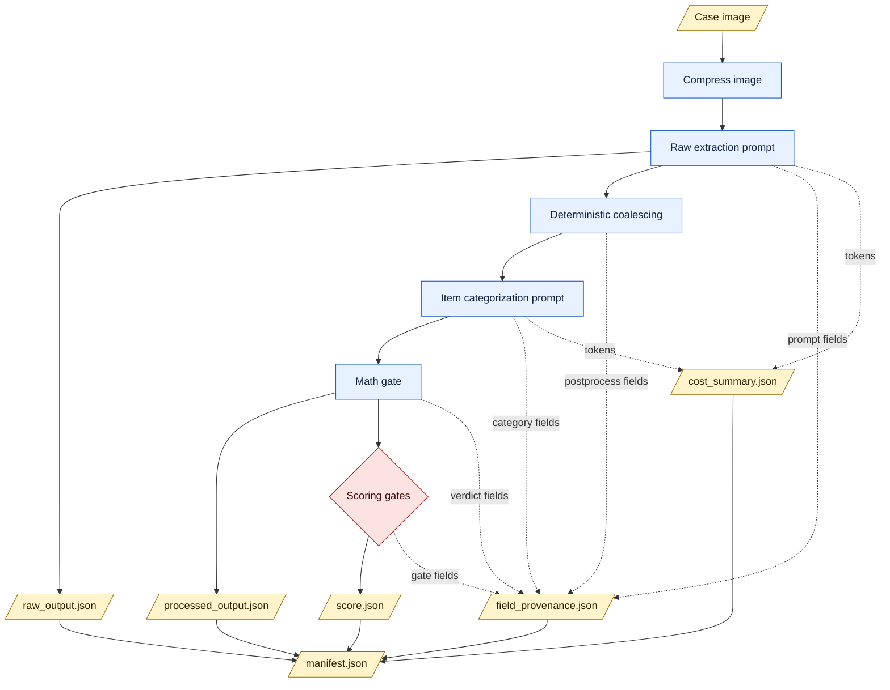
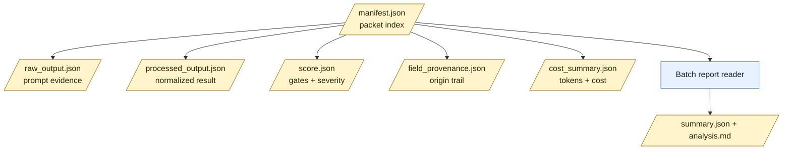
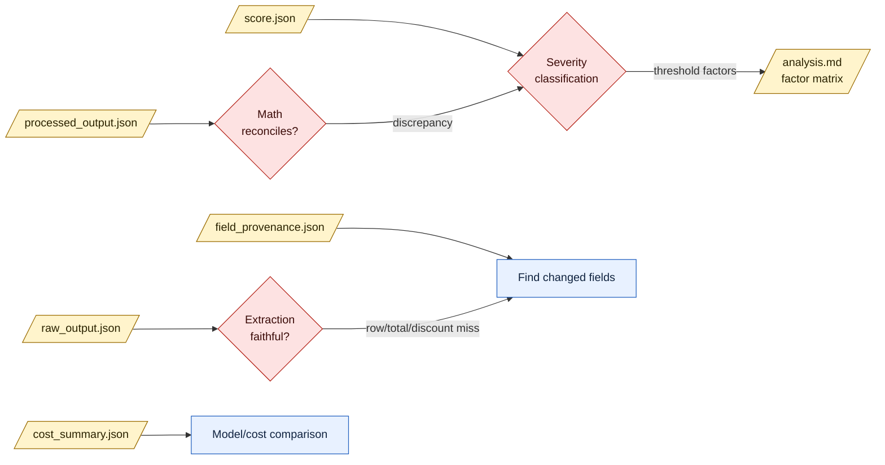
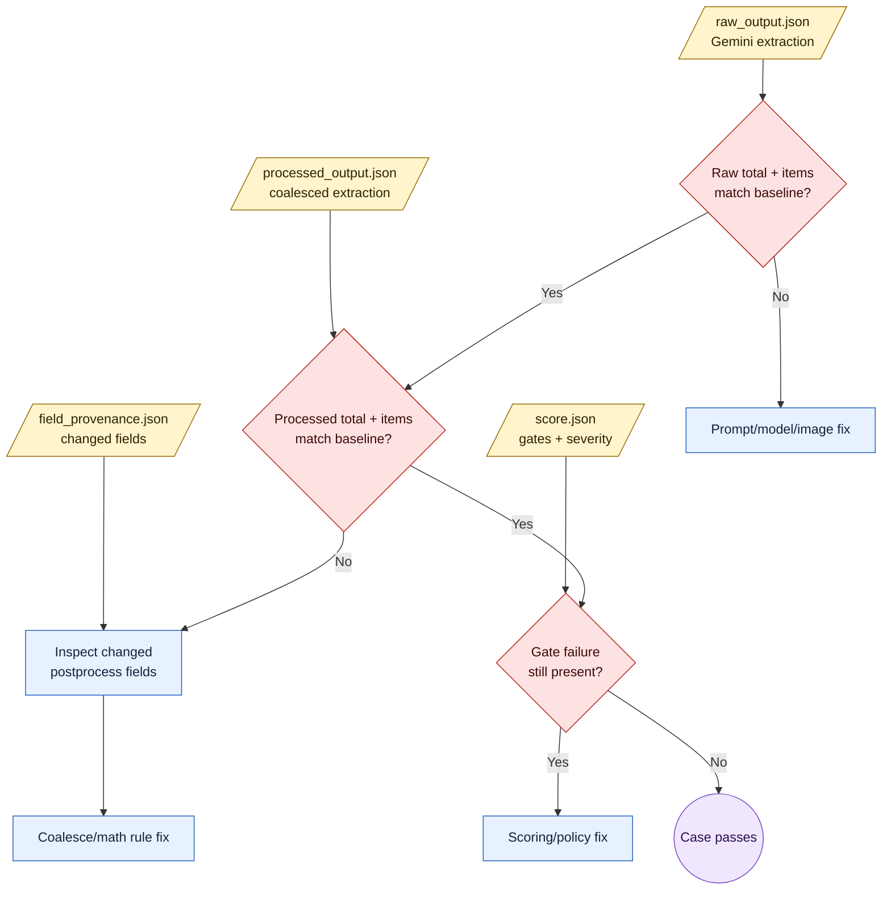
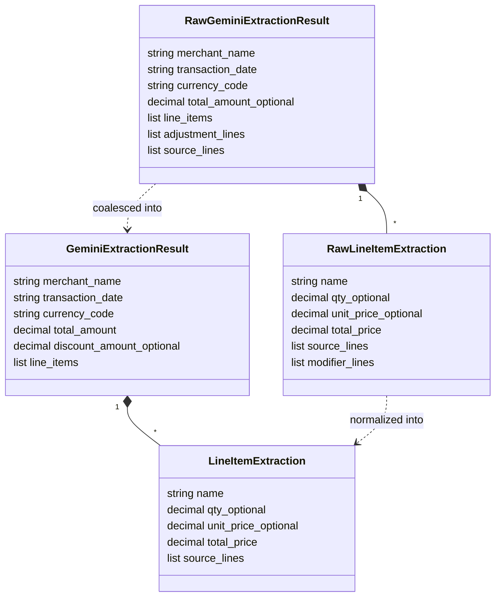
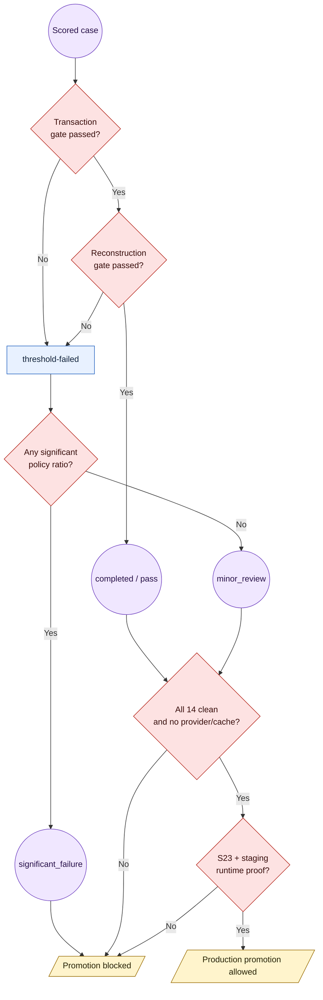

# Receipt Scan And Prompt-Lab Pipeline

This file is the durable map for how one receipt image becomes prompt-lab
artifacts and, in the runtime path, a persisted transaction. The prompt lab and
the application path intentionally share the same prompt registry, image
preparation, extraction agent, categorization agent, deterministic coalescing,
math gate, and cost-pricing helper. Prompt-lab evidence is still AI-quality
evidence only; it does not replace staging-e2e S23 fixture proof or staging live
Gemini proof.

This document is receipt-only. Credit-card statement PDF ingestion, statement
line extraction, statement-to-receipt matching, and statement-only transaction
candidates live in `prompt-testing/STATEMENT-PIPELINE.md`.

## Diagram Grammar

The diagrams in this document use different shapes for different roles. This
keeps processes, artifacts, decisions, stores, and events visually distinct.



## Main Code Ownership

| Area | File | Responsibility |
| --- | --- | --- |
| Prompt registry | `backend/app/prompts/registry.py` | Looks up prompt IDs and versions. |
| Receipt extraction prompt | `backend/app/prompts/receipt/extraction.py` | Defines production and dev-only receipt image prompts. |
| Item categorization prompt | `backend/app/prompts/receipt/item_categorization.py` | Defines item text to L4 category prompt. |
| Prompt value lists | `backend/app/prompts/values.py` | Shared currency and taxonomy text used by prompts. |
| Image preparation | `backend/app/prompt_lab/receipt/runner.py`, `backend/app/services/image.py` | Loads and compresses receipt images before extraction. |
| Raw extraction agent | `backend/app/agents/extraction.py` | Calls Gemini vision extraction and returns raw plus processed extraction. |
| Deterministic coalescing | `backend/app/services/coalesce.py` | Converts raw receipt evidence into canonical scan extraction fields. |
| Categorization agent | `backend/app/agents/categorization.py` | Categorizes extracted items into canonical L4 category keys. |
| Math gate | `backend/app/services/math_gate.py` | Reconstructs totals and emits reconciliation verdicts. |
| Runtime persistence | `backend/app/services/persist_scan.py` | Creates transactions, items, images, costs, mapping provenance, and FX shadow. |
| Runtime orchestration | `backend/app/services/scan_worker.py` | Drives scan status transitions and WebSocket/SSE progress events. |
| Prompt-lab artifacts | `backend/app/prompt_lab/receipt/runner.py` | Writes case manifests and per-stage JSON artifacts. |
| Prompt-lab scoring | `backend/app/prompt_lab/receipt/scoring.py` | Compares output to baselines and applies transaction/reconstruction gates. |
| Batch reporting | `backend/app/prompt_lab/receipt/batch_report.py` | Writes batch summary, analysis, promotion threshold, and promotion decision. |
| Pricing | `backend/app/services/llm_costs.py` | Shared provider token pricing and estimated cost helper. |

The code ownership diagram shows the main modules by responsibility rather than
by call order.



## Runtime Scan Path

The production worker is `backend/app/services/scan_worker.py`.

This state diagram is the runtime status lifecycle for a real uploaded scan.



| Stage | Status/Event | Main output |
| --- | --- | --- |
| Upload | `SUBMITTED` scan row | API stores image path, thumbnail path, content type, ownership scope, and submitted timestamp. |
| Acquire | `PROCESSING`, `scan_started` | Worker claims eligible scan or resumes `EXTRACTED` scans. |
| Load image | `image_processed` | Image bytes are loaded from disk; event includes `size_bytes`. |
| Stage 1 extraction | `EXTRACTED`, `extraction_complete` | `ExtractionResult` with `GeminiExtractionResult`, raw extraction, prompt ID/version, model name, token usage, and latency. |
| Stage 2 categorization | `CATEGORIZED`, `categorized` | `CategorizationOutput` with item `assignments[]`, prompt ID/version, token usage, and latency. |
| Math gate | `math_verified` | `MathReconciliationVerdict` with `passed`, `reconstructed_total`, `discrepancy_minor_units`, `discrepancy_ratio`, and `severity`. |
| Review signals | `build_scan_review_signals()` | Runtime-only `ScanReviewSignal[]` from raw extraction, processed extraction, and the math verdict. |
| Persistence | transaction rows | `Transaction`, `TransactionItem`, and `TransactionImage` rows are created. |
| Terminal event | `scan_complete` or `scan_failed` | Client receives transaction ID, merchant, totals, item count, item rows, confidence, reconciliation diagnostics, `review_level`, `review_signals`, or typed error. |

Runtime persistence creates these important fields:

| Field group | Fields |
| --- | --- |
| Transaction totals | `total_minor`, `discount_total_minor`, `gross_total_minor`, `reconstructed_total_minor`, `currency` |
| FX/cost | `amount_usd_minor`, `fx_rate_to_usd`, `fx_captured_at`, `llm_tokens_in`, `llm_tokens_out`, `llm_cost_usd`, `llm_latency_ms` |
| Prompt provenance | `prompt_version` from extraction, categorization, store categorization, and model identity |
| Merchant/store provenance | `merchant_source`, `store_category_source`, `store_category_confidence`, `store_category_mapping_id` |
| Scan review | `scan_review_level`, `scan_review_signals` |
| Items | `name`, `qty`, `unit_price_minor`, `total_price_minor`, `item_category_id`, `subcategory`, `category_source`, `sort_order` |
| Images | Original image and optional thumbnail rows linked to the transaction |

## Runtime Review Signals

Runtime review signals are the bridge between the accepted v2-dev.9
`minor_review` risk and the future app warning UI. They are diagnostic hints,
not proof that a line item is wrong. Live scans do not have prompt-lab expected
baselines, so the signal helper only uses evidence available at runtime: raw
extraction, processed extraction, and the math verdict.



| Signal code | Source stage | Level effect | Meaning |
| --- | --- | --- | --- |
| `math_reconciliation_delta` | `math_gate` | `needs_review` | Deterministic item/tax/discount reconstruction does not match the final total. Scan status still routes to `NEEDS_REVIEW`. |
| `item_structure_changed` | `postprocess` | `warning` | Post-processing changed the item count between raw and processed extraction. This catches added/lost rows without needing a baseline. |
| `discount_evidence_unresolved` | `postprocess` | `warning` | Raw discount/adjustment evidence exists but the processed transaction did not resolve it to the same discount amount or sum. |
| `visible_total_conflict` | `postprocess` | `warning` | Conservative visible-total evidence still conflicts with the extracted total after deterministic cleanup. |
| `synthesized_service_item` | `postprocess` | `warning` | Coalescing created one service row from the transaction total because the raw extraction had no item rows. |

The terminal `scan_complete` payload now uses the typed `ScanCompleteData`
contract. Existing fields are preserved, and the new fields are:

| Field | Meaning |
| --- | --- |
| `review_level` | `none`, `warning`, or `needs_review`. |
| `review_signals[]` | Typed signal objects with `code`, `severity`, `source_stage`, `message`, and JSON `details`. |

The transaction API exposes `scan_review_level` in list responses and both
`scan_review_level` plus `scan_review_signals` in detail responses. Manual
transaction create/update does not accept these fields in this backend pass.

## Prompt-Lab Case Path

The receipt prompt-lab runner is `backend/app/prompt_lab/receipt/runner.py`. A normal live case
uses this shape:



| Stage | Code | Artifact or packet field |
| --- | --- | --- |
| Case discovery | `backend/app/prompt_lab/receipt/cases.py` | Case ID, image path, baseline path, baseline status. |
| Image prep | `prepare_image()` in `runner.py` | Raw and processed image hashes, content types, image sizes for dry-run packets. |
| Raw cache key | `backend/app/prompt_lab/cache.py` | `raw_cache_key`, keyed by raw image hash, processed image hash, model, extraction prompt, and scan context. |
| Processed cache key | `backend/app/prompt_lab/cache.py` | `processed_cache_key`, adding categorization prompt to the raw cache identity. |
| Raw extraction | `extract_receipt()` | `raw_output.json`, `usage.extraction`, raw cache file. |
| Postprocess | `coalesce_extraction()` | `processed_output.extraction`; deterministic canonical totals, items, discounts, and warnings. |
| Categorization | `categorize_items()` | `processed_output.categorization.assignments[]`. |
| Math gate | `reconcile()` | `processed_output.verdict`. |
| Scoring | `score_prompt_run()` | `score.json`, `strict_status`, `severity_status`, transaction gate, reconstruction gate. |
| Provenance | `build_field_provenance()` | `field_provenance.json`, with field-level origin stages. |
| Cost summary | `build_cost_summary()` | `cost_summary.json`, with tokens and estimated cost per stage. |
| Manifest | `_write_manifest()` | `manifest.json`, plus paths to optional artifacts and evidence labels. |
| Batch report | `write_batch_report()` | `<label>-summary.json`, `<label>-analysis.md`, promotion threshold, promotion decision. |

## Per-Scan Artifact Packet

A grouped run uses:

```text
prompt-testing/results/latest/<environment>/<extraction-prompt>/<run-id>/<case-id>/
```

When `--run-id` is omitted, the CLI generates a sortable run folder name:

```text
YYYYMMDDTHHMMSSZ-001-short-label
```

Use an explicit `--run-id` only when several commands need to append to the same
known evidence folder.

Each case folder is one scan packet. A completed prompt-lab scan writes these
six files:



| File | Created by | What it answers | Key fields |
| --- | --- | --- | --- |
| `raw_output.json` | Raw extraction stage | What did Gemini read directly from the image before deterministic cleanup? | `raw_output.extraction.merchant_name`, `transaction_date`, `currency_code`, `total_amount`, `tax_amount`, `discount_amount`, `line_items[]`, `adjustment_lines[]`, `source_lines[]`, `confidence_score` |
| `processed_output.json` | Coalescing, categorization, and math gate | What normalized scan result would the runtime use after postprocessing? | `extraction`, `categorization.assignments[]`, `verdict.passed`, `verdict.reconstructed_total`, `verdict.discrepancy_minor_units`, `verdict.discrepancy_ratio`, `verdict.severity` |
| `score.json` | Prompt-lab scoring | Did the result pass the transaction gate and reconstruction gate, and how severe is any failure? | `transaction_gate`, `reconstruction_gate`, `passed`, `strict_status`, `severity_status`, `severity_reasons`, `validation_policy` |
| `field_provenance.json` | Provenance builder | Which fields came from the prompt, which were changed by deterministic postprocessing, and which were created by scoring or math? | `summary`, `fields[].field_path`, `fields[].origin_stage`, `fields[].operation`, `fields[].raw_value`, `fields[].final_value`, `fields[].notes` |
| `cost_summary.json` | Cost summary builder | How many tokens did each model stage use, and what was the estimated provider cost? | `model_name`, `pricing`, `stages.extraction`, `stages.categorization`, `totals.input_tokens`, `totals.output_tokens`, `totals.cost_usd` |
| `manifest.json` | Runner manifest writer | What case was run, which model/prompts/cache keys were used, what was the final status, and where are the other five files? | `case_id`, `environment`, `model`, `prompt_identity`, `raw_cache_key`, `processed_cache_key`, `status`, `evidence_label`, `artifact_layout`, `*_path` fields |

The `manifest.json` is the index. The other five files are the evidence. The
batch report reads the manifests, follows their artifact paths, and writes the
run-level `*-summary.json` and `*-analysis.md` files.

## Current Issue Map

The current 14-case `v2-dev.9` run has 7 strict threshold failures and 7
passes. All 7 strict failures are `minor_review`; no case is currently a
`significant_failure`. The issue points map directly to the six files above and
to the runtime review-signal codes:



| Issue point | Where to inspect first | Current examples |
| --- | --- | --- |
| Raw extraction missed, duplicated, or misread rows | `raw_output.json`, then `field_provenance.json` | `other/estacionamiento` has no raw item and is synthesized after extraction; `supermarket/super_lider_arrugado`, `supermarket/super_lily`, `trips/US/descuentos`, and `trips/US/long` have small item amount or row issues. |
| Visible total or receipt discount evidence conflicts with deterministic reconstruction | `raw_output.json`, `processed_output.json`, `field_provenance.json` | Maps to `visible_total_conflict` or `discount_evidence_unresolved` in runtime scans. `supermarket/super_lider` no longer has the article-count visible-total false conflict; `supermarket/super_lily` recognizes `Total Descuentos`; `trips/US/descuentos` still has a small discount delta and extra item rows. |
| Math gate cannot reconcile final total from items, tax, and discount | `processed_output.json` | Maps to `math_reconciliation_delta` and `scan_review_level=needs_review`. `supermarket/super_lily` has a 1090 CLP discrepancy, `trips/US/descuentos` has a 478 USD-minor-unit discrepancy, and `trips/US/long` has a 10 USD-minor-unit discrepancy. |
| Scoring promotes a strict failure into `minor_review` or `significant_failure` | `score.json`, then the batch `*-analysis.md` Threshold Factor Matrix | One-line service receipts with exact positional amounts use `severity_basis=single-item-positional`, so name mismatch remains a strict reconstruction issue but no longer becomes significant amount severity. |
| Cost or model comparison questions | `cost_summary.json` | The 14-case v2-dev.9 run used 73,957 provider-reported tokens and estimated `$0.0143665` on `gemini-2.5-flash-lite`. |

## Raw Vs Processed Arithmetic Triage

The batch analysis now compares `raw_output.json` and `processed_output.json`
against the same baseline. This makes the first failure point explicit:



The `Raw Vs Processed Arithmetic` table in the batch `*-analysis.md` file uses
these fields:

| Topic | Source | Meaning |
| --- | --- | --- |
| Transaction total delta | `raw_output.json`, `processed_output.json`, baseline | If this is zero, the final payable transaction total was read correctly. |
| Item identity coverage | raw and processed `line_items[].name`, baseline items | Rough name-similarity coverage for whether the expected items appear at all. This is diagnostic only, not a promotion gate. |
| Item count delta | raw and processed `line_items[]`, baseline items | Whether the scan added or lost item rows. |
| Item total-price matches | raw and processed `line_items[].total_price`, baseline items | Name-aware item price correctness. Positional counts remain diagnostics for row-order drift and one-line service receipts. |
| Gross item-sum delta | sum of raw and processed `line_items[].total_price`, baseline gross item sum | The total value distance before receipt-level discount. This separates line-item amount drift from final transaction total correctness. |
| Stage attribution | derived from raw diagnostics, processed diagnostics, and `score.json` | `raw-extraction`, `postprocess/math`, `scoring/policy`, `pass`, or `unbaselined`. |

The `Item Price Delta Details` table then lists the first item-level
`expected_total_minor -> actual_total_minor` differences for each case, with a
signed `delta_minor`. That table is the fastest way to see whether a failure is
one small item-price miss, a missing row, an extra row, or a broad positional
alignment problem.

Severity should be read in four layers:

| Layer | Good enough condition | Fix belongs first in |
| --- | --- | --- |
| Transaction total | Transaction total delta is `0` even if item detail is still imperfect. | Prompt only when the raw transaction total is wrong or missing. |
| Items present | Expected item names and item count are covered. | Prompt/model/image handling when raw coverage is wrong; coalescing when raw coverage is right but processed coverage changes. |
| Item prices | Name-aware item total-price matches are complete, and gross item-sum delta is `0`. | Prompt when raw prices are wrong; coalescing/math when raw prices are right but processed prices or discount math drift. |
| Scoring | Processed arithmetic is right but a strict gate still fails. | Scoring contract, visible-total policy, single-item service-label policy, or severity threshold tuning. |

## Extraction Fields

Raw extraction uses `RawGeminiExtractionResult`:



| Field | Meaning |
| --- | --- |
| `merchant_name` | Merchant text chosen by the extraction prompt. |
| `transaction_date` | ISO date string from visible receipt evidence. |
| `currency_code` | ISO currency code. |
| `total_amount` | Visible final total in integer minor units, or null when unreadable in raw output. |
| `tax_amount` | Separately listed added tax in integer minor units, when applicable. Included VAT/IVA should normally remain null. |
| `discount_amount` | Positive receipt-level summary discount when separately listed. |
| `line_items[]` | Raw item rows with `name`, `qty`, `unit_price`, `total_price`, `source_lines`, and `modifier_lines`. |
| `adjustment_lines[]` | Discount/adjustment evidence rows with label, positive amount, source lines, and confidence. |
| `source_lines[]` | Visible receipt text copied as evidence for totals, dates, merchant, and adjustments. |
| `confidence_score` | Prompt confidence from 0 to 1. |

Processed extraction uses `GeminiExtractionResult`:

| Field | Meaning |
| --- | --- |
| `merchant_name`, `transaction_date`, `currency_code` | Canonical transaction identity fields after postprocessing. |
| `total_amount` | Required final payable total in integer minor units. |
| `tax_amount` | Added tax only, if separate and applicable. |
| `discount_amount` | Positive transaction-level receipt discount, or null. |
| `line_items[]` | Canonical product/service rows. Scan-created item-level discount fields are left null. |
| `confidence_score` | Final extraction confidence. |

## Scoring And Promotion

Prompt-lab scoring has two strict gates:



| Gate | Must prove |
| --- | --- |
| Transaction gate | Merchant, currency, final total, no visible-total conflict, valid item category keys, and math gate completion. |
| Reconstruction gate | Exact expected item count, name-aware item total matches, quantity matches, unit-price matches, and receipt discount match. |

The latest scoring contract includes item-total correctness in the
reconstruction gate. A run cannot look reconstructed when item totals are wrong.
For severity only, a one-item receipt with exact positional item total,
quantity, and unit price can use `severity_basis=single-item-positional`; this
prevents generic service labels from becoming significant price failures while
still keeping the strict reconstruction gate failed.

The batch promotion contract is `receipt-extraction-promotion-v1`:

| Requirement | Meaning |
| --- | --- |
| 14 scored cases | The full baseline set must be present. |
| No-cache evidence | Cache-derived or missing-cache packets block promotion. |
| Zero provider errors | Final provider-error packets block promotion. |
| Zero `significant_failure` | Minor reviews may remain review items, but significant failures block promotion. |
| Classified failures | Threshold failures must have severity classification. |
| Runtime proof | Production promotion still requires staging-e2e S23 fixture proof and staging live Gemini smoke. |

## What Changed In The v2-dev.9 Pass

The latest Phase 2D pass kept the production prompt unchanged and updated only
the dev-only candidate, deterministic postprocessing, prompt-lab scoring, and
prompt-lab reporting:

- `backend/app/prompt_lab/receipt/scoring.py` now keeps positional item match counts as
  diagnostics and adds name-aware counts for item totals, quantities, unit
  prices, full item matches, and matched item names.
- `backend/app/prompt_lab/receipt/scoring.py` uses name-aware reconstruction severity
  for multi-item receipts, exact item count as a strict reconstruction gate, and
  a severity-only single-item positional fallback for generic one-line service
  receipts.
- `backend/app/prompt_lab/receipt/batch_report.py` now writes schema
  `prompt-lab-batch-summary.v8`; the analysis tables show name-aware versus
  positional item matching, severity basis, raw-vs-processed arithmetic, item
  price deltas, and fix focus.
- `backend/app/prompts/receipt/extraction.py` bumped the dev-only
  `receipt-extraction-v2-evidence` candidate to `2026-05-20.v2-dev.9`, with
  added guidance for nearby quantity lines, separate discount/savings evidence,
  and long receipt table continuity.
- `backend/app/services/coalesce.py` now excludes article-count lines from
  visible-total candidates, recognizes plural Spanish discount labels such as
  `Total Descuentos`, and avoids worsening `N FOR` item totals when explicit
  adjustment evidence is present.

## What Changed In The Backend Review-Signal Pass

The gravity-well follow-up kept the work in G4 Scan Pipeline by default and
crossed wells only for contracts:

- `backend/app/schemas/scan.py` defines `ScanReviewSignal`,
  `ScanReviewLevel`, and typed `ScanCompleteData`.
- `backend/app/services/scan_review.py` is the one new G4 helper. It computes
  runtime signals from raw extraction, processed extraction, and
  `MathReconciliationVerdict`.
- `backend/app/services/scan_worker.py` includes `review_level` and
  `review_signals` in `scan_complete` events without changing completed versus
  needs-review status behavior.
- `backend/app/services/persist_scan.py` persists `scan_review_level` and
  `scan_review_signals` on scan-created transactions.
- `backend/app/api/transactions.py` exposes `scan_review_level` in list
  responses and full `scan_review_signals` in transaction detail responses.
- `backend/app/models/transaction.py` plus Alembic revision `013` add the two
  transaction columns. Manual create/update schemas still do not accept these
  scan-owned fields.

The v2-dev.9 no-cache run used run id
`20260520Treceipt-v2dev9-14-case-no-cache` and wrote:

- `prompt-testing/results/latest/local/receipt-extraction-v2-evidence/20260520Treceipt-v2dev9-14-case-no-cache/14-case-v1-v2dev9-no-cache-summary.json`
- `prompt-testing/results/latest/local/receipt-extraction-v2-evidence/20260520Treceipt-v2dev9-14-case-no-cache/14-case-v1-v2dev9-no-cache-analysis.md`

Run result:

| Metric | Value |
| --- | --- |
| Case count | `14` |
| Provider errors | `0` |
| Cache-derived evidence | `0` |
| No-cache evidence valid | `true` |
| Strict counts | `7 completed`, `7 threshold-failed` |
| Severity counts | `7 pass`, `7 minor_review`, `0 significant_failure` |
| Prompt-lab threshold | passed |
| Production promotion | blocked until staging-e2e S23 fixture and staging live Gemini proof |

## Accepted State And Risks

As of the v2-dev.9 run, the prompt-lab state is accepted for moving forward
with runtime proof work. This is not a claim that every item is perfect. It is
a decision that the remaining failures are reviewable scan-quality issues, not
prompt-lab blockers.

Accepted:

- Every remaining strict failure has raw transaction total delta `0`; the final
  payable total is correct in the current 14-case evidence.
- `minor_review` cases may remain when item names, service-line labels,
  quantities, unit prices, small item amounts, discount details, or category
  assignments need user review.
- Generic one-line service rows and synthesized service rows are acceptable
  when the final total is correct; users can correct names/categories later.
- Small item amount discrepancies are acceptable when they are below the
  significance threshold and a review signal can guide the user.

Not accepted silently:

- Math failure, item-count mismatch, receipt-discount mismatch, or meaningful
  item amount discrepancy should be eligible for a visible user warning in the
  app.
- Discount-heavy/promotion-heavy receipts can still produce extra rows or
  small discount deltas. Those should enter the scan-review path rather than
  being treated as clean.
- Future candidates that regress final transaction total extraction or produce
  `significant_failure` cases must reopen prompt/postprocess work.

Runtime UI implication:

- Backend transactions now persist `scan_review_level` and
  `scan_review_signals`; mobile/web warning UI consumes those fields in a later
  pass.
- Preserve original extracted item order as the receipt-order view. This lets
  users compare the item list side by side against the receipt image.
- Category grouping is a second view over the same extracted items. It should
  not replace receipt order, and each item should retain enough ordering
  metadata to return to the image-comparison view.
- Category assignments and item names are user-correctable quality fields;
  final payable amount and review-warning state are the load-bearing fields.

The production prompt remains separate from the dev-only candidate. The
v2-dev.9 run did not promote the candidate to production.
